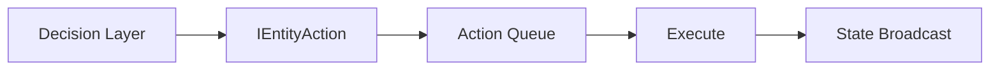

# Architecture Document Template

> Reference: Architecture documents capture current system design decisions and patterns.

---

## Document Constraints

All architecture documents enforce:

| Constraint | Rule |
|------------|------|
| **Audience** | Senior engineers; assumes domain expertise |
| **Density** | Maximum information per line; no filler |
| **Code** | Inline signatures only (≤1 line); source is implementation |
| **Diagrams** | Mermaid only; no ASCII art |
| **Scope** | Decisions and patterns, not tutorials |
| **Maintenance** | Update on architectural change only |
| **Length** | Target <150 lines; split if exceeds |
| **Future Plans** | Architecture documents reflect current architecture only; no references to future plans or new ideas |

---

## Required Sections

### Header
```markdown
# [System] Architecture

> *"[Relevant design quote]"* — [Attribution]

*Template: [../Templates/ArchitectureTemplate.md](../Templates/ArchitectureTemplate.md)*
```

### Core Principle
One paragraph + benefits table. State the fundamental invariant that drives all design decisions.

### Authority/Ownership Model
Table of responsibilities. Who owns what state? Who mutates? Who reads?

### Data Flow
How data moves through the system. Use inline notation `A → B → C` or Mermaid diagrams for complex flows.

### Protocol/Interface
Tables for message types, method signatures, or API contracts. Include IDs where applicable.

### Patterns
Named patterns with anti-patterns. Format: `**Anti-pattern**: X. **Pattern**: Y.`

### Diagnostics
Table of observable properties for debugging/monitoring.

### Design Principles
Numbered list, one line each. Maximum 7 items. Each principle captures a decision, not a goal.

---

## Documenting Decisions

Architecture docs capture **decisions**, not just structure. For significant choices:

| Element | Format |
|---------|--------|
| Problem statement | **Problem**: [concise issue] |
| Decision | **Decision**: [what we chose] |
| Components | Table of types/roles if multiple |
| Benefits | Bullet list of concrete gains |

Avoid justifying obvious choices. Document non-obvious tradeoffs.

---

## Mermaid Diagrams

Use Mermaid for complex flows where inline notation is insufficient. Keep diagrams minimal.

**Allowed types**: `flowchart`, `sequenceDiagram`, `stateDiagram-v2`, `classDiagram`

**Example** (data flow):


**Rules**:
- Maximum 10 nodes per diagram
- No styling/colors (keep portable)
- Prefer `flowchart LR` (left-right) for data flow
- Prefer `sequenceDiagram` for request/response patterns

---

## Formatting Rules

| Element | Format |
|---------|--------|
| Class/Method names | `BacktickCode` |
| Inline flows | `A → B → C` |
| Patterns | **Bold label**: description |
| Tables | Prefer over prose for structured data |
| Lists | Numbered for ordered items, bullets for unordered |
| Emphasis | Bold for terms, italic for quotes only |

---

## Anti-Patterns

- ❌ Multi-line code blocks (>1 line)
- ❌ ASCII box diagrams
- ❌ Tutorial-style explanations
- ❌ Implementation details that change frequently
- ❌ Duplicate information from source code
- ❌ Version history (use git)
- ❌ Justifying obvious choices
- ❌ Mermaid diagrams with >10 nodes

---

## File Naming

`[SystemName]Architecture.md` — PascalCase, no spaces, suffix `Architecture`.

Examples: `NetworkingArchitecture.md`, `ChunkingArchitecture.md`, `AIArchitecture.md`
