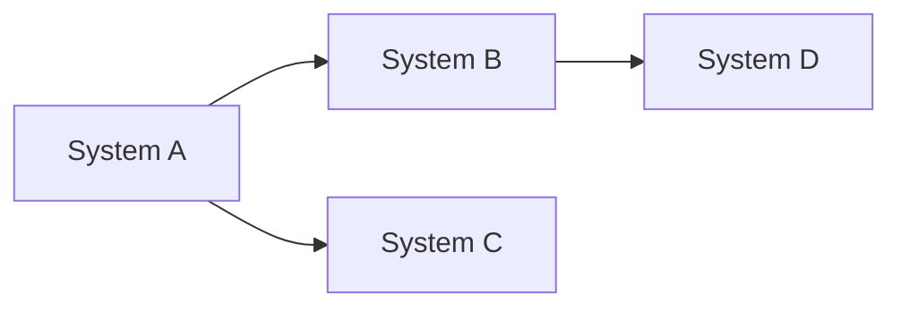

# Execution Plan Template

> Reference: All execution plan documents must conform to this template.

---

## Document Constraints

| Constraint | Rule |
|------------|------|
| **Audience** | Senior engineers + AI agents; domain expertise assumed |
| **Density** | Max info/line; zero redundancy with Implementation Plans |
| **References** | Link to Impl Plans; never duplicate phase content |
| **Diagrams** | Mermaid only; no ASCII |
| **Scope** | Orchestration, deps, file targets, AI prompts |
| **Maintenance** | Weekly update; changelog required |
| **Length** | Target <150 lines |

---

## Required Sections

### Header
```markdown
# Execution Plan

*Template: [../Templates/ExecutionPlanTemplate.md](../Templates/ExecutionPlanTemplate.md)*
```

### Summary Table
| System | Plan | Days | Deps |

Link to Implementation Plans. No phase details.

### Dependency Graph
Mermaid `flowchart LR`. Show critical path.



### Weekly Schedule
| Week | Systems | Phases | Devs | Milestone |

Reference phases by number; details live in Impl Plans.

### Key Files
```
[ACTION] path/File.cs — Description
```
Actions: `CREATE`, `MODIFY`, `DELETE`

### AI Iteration Protocol
- Phase Start prompt
- Code Change prompt
- Validation prompt
- Cross-System Query table

### Dev Assignments
| Pool | Systems | Escalation |

### Risk Matrix
| Risk | P | I | Mitigation | Owner |

P = Probability (L/M/H), I = Impact (L/M/H)

### Done Criteria
Checkboxes for gates.

### Changelog
| Date | Change | Author |

---

## Mermaid Diagrams

**Required for**: Dependency graphs, parallel execution visualization.

**Rules**:
- `flowchart LR` for dependencies
- Max 10 nodes
- No styling/colors
- Critical path highlighted via node naming

---

## AI Prompt Templates

### Execute Phase
```
Execute [System] Phase [N] per ../Implementations/[System]ImplementationPlan.md.
Files: [from Key Files]. Validate: [test].
```

### Code Modification
```
[ACTION] path/File.cs:Method — Description.
Test: [assertion]. Constraint: [risk mitigation].
```

### Cross-Reference
| Query | ? | Source |
|-------|---|--------|
| "What does X return?" | ? | [System] Impl Phase N |

---

## Anti-Patterns

| ? Avoid | ? Instead |
|----------|-----------|
| Copy phase steps from Impl Plans | Reference: "See [Impl] Phase N" |
| ASCII diagrams | Mermaid |
| Prose | Tables, bullets |
| Vague milestones | Concrete: "Brain uses net values" |
| Generic risks | Specific + owner |

---

## File Naming

`ExecutionPlan.md` — Single file per project or workstream.
