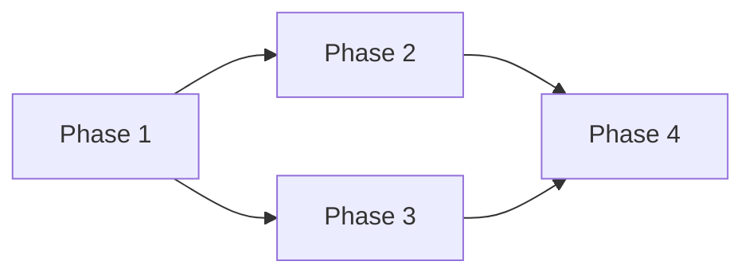

# Implementation Plan Template

> Reference: All implementation plan documents must conform to this template.

---

## Document Constraints

| Constraint | Rule |
|------------|------|
| **Audience** | Senior engineers + AI agents; domain expertise assumed |
| **Density** | Max info/line; no filler |
| **Code** | Inline signatures only (?1 line); source is implementation |
| **Diagrams** | Mermaid only; no ASCII |
| **Scope** | Execution roadmap for proposals; not design |
| **Maintenance** | Update as implementation progresses |
| **Length** | Target <150 lines; split if exceeds |

---

## Required Sections

### Header
```markdown
# Implementation Plan

*Template: [../Templates/ImplementationPlanTemplate.md](../Templates/ImplementationPlanTemplate.md)*
```

### Summary
One line: system name, phase count, total days.

### Proposal Breakdown
| Phase | Days | Deps | Deliverable |

### Phase Dependencies
Mermaid `flowchart LR` if phases have non-linear deps.



### Detailed Steps
Per phase:
```markdown
### Phase N: [Name]
1. [ACTION] `File.cs` — Description
2. [ACTION] `File.cs:Method` — Description
3. Test: [assertion]
```

Actions: `CREATE`, `MODIFY`, `DELETE`, `TEST`

### Timeline
| Days | Phase | Parallel? |

### Resources
| Devs | Scope | Tools |

### Risks
| Risk | Mitigation |

---

## Formatting Rules

| Element | Format |
|---------|--------|
| Phases | `### Phase N: Name` |
| Steps | Numbered, action prefix |
| Deps | Mermaid or inline `A ? B` |
| Files | `BacktickCode` with action |

---

## AI Optimization

Phases structured for direct AI execution:
```
Execute Phase [N] of [System]ImplementationPlan.md.
Steps: [1-N]. Validate: [test criteria].
```

Each step should be independently executable and verifiable.

---

## Anti-Patterns

| ? Avoid | ? Instead |
|----------|-----------|
| Prose descriptions | Numbered steps with actions |
| Vague deliverables | Concrete: "EntityBrain.Think() uses net values" |
| Multi-line code | Inline signatures only |
| ASCII diagrams | Mermaid |
| Unbounded phases | Each phase ?3 days |

---

## File Naming

`[SystemName]ImplementationPlan.md` — PascalCase, suffix `ImplementationPlan`.