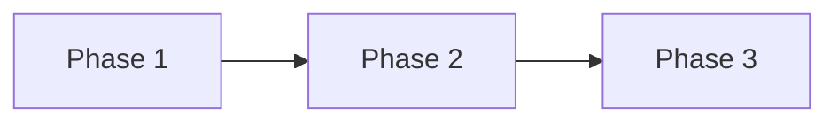

# Proposal Document Template

> Reference: Proposals introduce new ideas, features, or approaches.

---

## Document Constraints

| Constraint | Rule |
|------------|------|
| **Audience** | Senior engineers + AI agents; domain expertise assumed |
| **Density** | Max info/line; no filler |
| **Code** | Inline signatures only (?1 line); source is implementation. No large code blocks |
| **Diagrams** | Mermaid only; no ASCII |
| **Scope** | Future plans, phases, concepts; not current architecture |
| **Maintenance** | Update as proposal evolves; archive when implemented |

---

## Required Sections

### Header
```markdown
# [Feature/System] Proposal

*Template: [../Templates/ProposalTemplate.md](../Templates/ProposalTemplate.md)*

## Problem Statement
[Concise description of issue/opportunity]

## Resolution
[High-level solution]
```

### Phases
Numbered, with effort estimates.

### Concepts
Inline: `Term: definition`

### Impact
| System/File | Change |

### Benefits
Bullet list.

### Risks
Bullet list.

---

## Optional Sections

### Detailed Concepts
Expanded explanations with inline signatures.

### Examples
Concrete usage with inline flows.

### Tech Debt
Related debt to address.

### Open Questions
Blockers requiring stakeholder input.

---

## Mermaid Diagrams

Use for phase deps or complex flows.



**Rules**:
- Max 10 nodes
- No styling
- `flowchart LR` for deps
- `sequenceDiagram` for interactions

---

## Formatting Rules

| Element | Format |
|---------|--------|
| Signatures | `BacktickCode` |
| Flows | `A ? B ? C` |
| Concepts | `Term: description` |
| Structure | Tables > prose |
| Lists | Numbered for phases, bullets for benefits/risks |

---

## Anti-Patterns

| ? Avoid | ? Instead |
|----------|-----------|
| Multi-line code | Inline signatures |
| ASCII diagrams | Mermaid |
| Current arch details | Link to Architecture docs |
| Vague plans | Actionable phases with effort |
| Duplicate info | Cross-reference |

---

## File Naming

`[FeatureName]Proposal.md` — PascalCase, suffix `Proposal`.