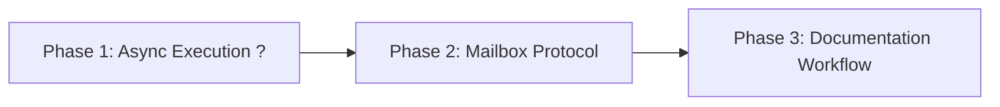

# Autonomous Bot Implementation Plan

**Status**: In Progress (Phase 1 Complete)
**Owner**: Lead Engineer
**Started**: 2025-07-15
**Target Completion**: TBD

*Template: [../../Templates/ImplementationPlanTemplate.md](../../Templates/ImplementationPlanTemplate.md)*

---

## Summary

Autonomous Bot system implementation: 3 phases enabling async execution, mailbox processing, and documentation workflow automation.

---

## Proposal Breakdown

| Phase | Days | Deps | Deliverable | Status |
|-------|------|------|-------------|--------|
| Phase 1 | 2 | None | Async execution path | ? **COMPLETE** |
| Phase 2 | 3 | Phase 1 | Mailbox protocol with batch concurrency | ? Partial (`send_message` implemented; now UNBLOCKED) |
| Phase 3 | 3 | Phase 2 | Documentation workflow automation | ?? Not Started |

---

## Phase Dependencies

---

## Detailed Steps

### Phase 1: Async Execution Path ? COMPLETE
1. ~~CREATE `Wally.Core/Mailbox/BatchContext.cs`~~ — Deferred to Phase 2
2. ~~MODIFY `Wally.Core/LLMWrappers/LLMWrapper.cs`~~ — ? `ExecuteAsync` with `WaitForExitAsync` + `process.Kill(entireProcessTree: true)` on cancellation; `Execute` is sync wrapper
3. ~~MODIFY `Wally.Core/WallyEnvironment.cs`~~ — ? `ExecutePromptAsync` + `ExecuteActorAsync` with `.ConfigureAwait(false)`; sync wrappers
4. ~~MODIFY `Wally.Core/WallyCommands.cs`~~ — ? `HandleRunTypedAsync` with `TextWriter? output` + `RunPipelineAsync`; sync wrappers
5. ~~MODIFY `Wally.Forms/Controls/ChatPanel.cs`~~ — ? Direct `await HandleRunTypedAsync` — no `Task.Run`
6. ~~MODIFY `Wally.Core/ActionDispatcher.cs`~~ — ? `send_message` action already implemented with YAML front-matter
7. ~~TEST~~ — ? Async execution works in ChatPanel; console behavior unchanged

### Phase 2: Mailbox Protocol with Batch Concurrency
1. CREATE `Wally.Core/Mailbox/WallyMessage.cs` — Message envelope model with YAML front-matter and batchId
2. CREATE `Wally.Core/Mailbox/MailboxRouter.cs` — Batch iteration orchestrator with atomic commit
3. CREATE `Wally.Core/Mailbox/MailboxWatcher.cs` — FileSystemWatcher wrapper with batch triggering
4. ~~MODIFY `Wally.Core/ActionDispatcher.cs`~~ — ? Already implemented — `ExecuteSendMessage` writes YAML front-matter messages to target actor's Inbox
5. CREATE `Wally.Console/Options/Run/WatchOptions.cs` — CLI options for daemon mode with batch configuration
6. MODIFY `Wally.Console/Program.cs` — Add `watch` verb handler for daemon mode
7. TEST: Verify batch processing cycle (snapshot ? concurrent processing ? atomic commit)
8. TEST: Verify mailbox lifecycle (Inbox ? Active ? Outbox/Pending) with failure isolation

### Phase 3: Documentation Workflow Automation
1. CREATE `Wally.Core/Default/Loops/DocumentationReflection.json` — Loop definition with convergence detection
2. MODIFY `Wally.Core/Actors/BusinessAnalyst/actor.json` — Add documentation reflection guidance to prompts  
3. MODIFY `Wally.Core/Actors/Engineer/actor.json` — Add technical documentation review patterns
4. MODIFY `Wally.Core/Actors/RequirementsExtractor/actor.json` — Add requirements completeness review
5. CREATE `Wally.Core/Default/Docs/DocumentationWorkflowGuide.md` — Usage patterns and best practices
6. TEST: Verify loop convergence detection prevents infinite cycles
7. TEST: Verify todo task persistence and cross-batch coordination
8. TEST: Validate complete documentation reflection workflow with real project data

---

## Timeline

| Days | Phase | Parallel? | Status |
|------|-------|-----------|--------|
| 1-2 | Phase 1: Async Execution | No | ? **COMPLETE** |
| 3-5 | Phase 2: Mailbox Protocol | No | ? Partial (now UNBLOCKED) |
| 6-8 | Phase 3: Documentation Workflow | No | ?? Not Started |

---

## Resources

| Devs | Scope | Tools |
|------|-------|-------|
| 1 Senior Engineer | Full-stack .NET 8, async patterns, file I/O | Visual Studio, Git, Mermaid |

---

## Risks

| Risk | Mitigation | Status |
|------|-----------|--------|
| Sync-over-async deadlock in batch processing | Use `.ConfigureAwait(false)` throughout Wally.Core | ? Implemented |
| FileSystemWatcher reliability on network drives | Add polling fallback with configurable interval | ?? Planned |
| Batch processing memory usage during large batches | Implement configurable batch size limits | ?? Planned |
| Documentation loop infinite cycles | Implement convergence detection with max iteration limits | ?? Prevention |

---

## Todo Tracker

| Task | Phase | Priority | Status | Owner | Due Date | Notes |
|------|--------|----------|--------|-------|----------|-------|
| ~~Create BatchContext for thread-local coordination~~ | Phase 1 | High | Deferred | @lead-engineer | — | Deferred to Phase 2 batch processing |
| ~~Implement async LLMWrapper.ExecuteAsync method~~ | Phase 1 | High | ? Complete | @lead-engineer | 2025-07-15 | `ExecuteAsync` + `RunProcessAsync` + kill on cancel |
| ~~Add async methods to WallyEnvironment~~ | Phase 1 | High | ? Complete | @lead-engineer | 2025-07-15 | `ExecutePromptAsync` + `ExecuteActorAsync` |
| ~~Add HandleRunTypedAsync to WallyCommands~~ | Phase 1 | High | ? Complete | @lead-engineer | 2025-07-15 | With `TextWriter? output` parameter |
| ~~Update ChatPanel to use direct await~~ | Phase 1 | Medium | ? Complete | @lead-engineer | 2025-07-15 | No `Task.Run` — direct `await` |
| Create WallyMessage envelope model | Phase 2 | High | ?? Not Started | @lead-engineer | TBD | Mailbox foundation |
| Implement MailboxRouter batch orchestration | Phase 2 | High | ?? Not Started | @lead-engineer | TBD | Core batch processing engine |
| Add MailboxWatcher for file system monitoring | Phase 2 | Medium | ?? Not Started | @lead-engineer | TBD | Event-driven processing |
| Create console watch verb for daemon mode | Phase 2 | Medium | ?? Not Started | @lead-engineer | TBD | CLI integration |
| Design DocumentationReflection loop definition | Phase 3 | High | ?? Not Started | @lead-engineer | TBD | Workflow automation |
| Update actor prompts for documentation awareness | Phase 3 | Medium | ?? Not Started | @lead-engineer | TBD | Actor capability enhancement |
| Test complete workflow with real project data | Phase 3 | High | ?? Not Started | @lead-engineer | TBD | End-to-end validation |
| Write usage documentation and best practices | Phase 3 | Low | ?? Not Started | @lead-engineer | TBD | User guidance |

---

## Acceptance Criteria

### Must Have (Required for Completion)
- [x] Async execution works without blocking UI thread
- [ ] Batch processing provides stable concurrency for multi-actor scenarios  
- [ ] Mailbox protocol enables file-based actor communication
- [ ] Documentation workflow automates reflection and task creation
- [ ] All integration tests pass for new functionality
- [x] Console behavior remains unchanged for single-user operations
- [x] Cancellation propagates end-to-end to LLM processes

### Should Have (Preferred for Quality)
- [ ] Batch size limits prevent memory issues during large operations
- [ ] FileSystemWatcher has polling fallback for network drives
- [ ] Documentation loop has convergence detection preventing infinite cycles
- [ ] Error handling covers all identified batch processing edge cases
- [ ] Performance benchmarks show no regression in single-user scenarios

### Completion Checklist
- [ ] All three phases completed with deliverables validated
- [ ] Code review completed and approved for all changes
- [ ] Integration testing completed in staging environment
- [x] Documentation updated to reflect new async capabilities
- [ ] Status updated to "Complete"

---

## Related Plans

| Plan | Relationship | Notes |
|------|--------------|-------|
| ~~[AsyncExecutionProposal](../Proposals/AsyncExecutionProposal.md)~~ | Implements | ? **COMPLETE** — archived to `../Archive/CompletedProposals/` |
| [MailboxProtocolProposal](../Proposals/MailboxProtocolProposal.md) | Implements | Phase 2 implementation source |
| [DocumentationWorkflowProposal](../Proposals/DocumentationWorkflowProposal.md) | Implements | Phase 3 implementation source |
| [AutonomousBotGapsProposal](../Proposals/AutonomousBotGapsProposal.md) | Implements | Parent proposal coordinating all phases |

---

## References

| Document | Relationship |
|----------|-------------|
| [MailboxSystemArchitecture](../Docs/MailboxSystemArchitecture.md) | Informs | Batch concurrency model specification |
| [ImplementationPlanTemplate](../../Templates/ImplementationPlanTemplate.md) | Follows | Document structure and formatting |
| [ProposalTemplate](../../Templates/ProposalTemplate.md) | Follows | Source proposal specifications |