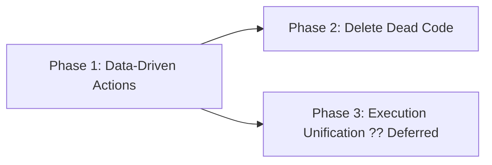

# Unified Execution Model — Implementation Plan

**Status**: Not Started
**Owner**: Lead Engineer
**Started**: —
**Target Completion**: TBD

*Template: [../../Templates/ImplementationPlanTemplate.md](../../Templates/ImplementationPlanTemplate.md)*

---

## Summary

Implement data-driven action dispatch from `actor.json`, removing all hardcoded actor-name checks from `ActionDispatcher`. Delete the dead `WallyPipeline` class. The `actor.json` files already declare the correct metadata — this plan makes the runtime read and enforce it.

**Source proposal**: [UnifiedExecutionModelProposal](../Proposals/UnifiedExecutionModelProposal.md)

---

## Proposal Breakdown

| Phase | Days | Deps | Deliverable | Status |
|-------|------|------|-------------|--------|
| Phase 1 | 2-3 | None | Data-driven action dispatch — `ActionDefinition` model, load/save, dispatcher validation | ?? Not Started |
| Phase 2 | 0.5 | None | Delete `WallyPipeline` dead code + fix stale XML doc comment | ?? Not Started |
| Phase 3 | — | Phase 1 | (Future) Unify execution routing — deferred, not in scope | ?? Deferred |

---

## Phase Dependencies



---

## Detailed Steps

### Phase 1: Data-Driven Action Dispatch

#### Step 1 — CREATE `Wally.Core/Actors/ActionParameterDefinition.cs`

New class. Fields:

```csharp
public class ActionParameterDefinition
{
    public string Name        { get; set; } = string.Empty;
    public string Type        { get; set; } = "string";
    public string Description { get; set; } = string.Empty;
    public bool   Required    { get; set; }
}
```

No dependencies. Pure data class — no logic.

---

#### Step 2 — CREATE `Wally.Core/Actors/ActionDefinition.cs`

New class. Fields:

```csharp
public class ActionDefinition
{
    public string Name        { get; set; } = string.Empty;
    public string Description { get; set; } = string.Empty;
    public string PathPattern { get; set; } = "**";
    public bool   IsMutating  { get; set; }
    public List<ActionParameterDefinition> Parameters { get; set; } = new();
}
```

No dependencies. Pure data class — no logic.

---

#### Step 3 — MODIFY `Wally.Core/Actors/Actor.cs`

Add one property after `Abilities`:

```csharp
/// <summary>
/// Role-specific actions declared in <c>actor.json</c> as <c>"actions": [...]</c>.
/// Each entry carries authorization metadata (pathPattern, isMutating, parameters)
/// used by <see cref="ActionDispatcher"/> at runtime.
/// </summary>
public List<ActionDefinition> Actions { get; set; } = new();
```

No other changes to `Actor.cs`.

---

#### Step 4 — MODIFY `Wally.Core/WallyHelper.cs` — `LoadActorFromDirectory`

After the line `abilities = TryGetStringList(root, "abilities");`, add:

```csharp
actions = TryGetActionList(root, "actions");
```

Add the local variable declaration at the top of the method:
```csharp
var actions = new List<ActionDefinition>();
```

Assign to the actor after construction:
```csharp
actor.Actions = actions;
```

Add the new private helper method:

```csharp
private static List<ActionDefinition> TryGetActionList(JsonElement element, string propertyName)
{
    var result = new List<ActionDefinition>();
    if (!element.TryGetProperty(propertyName, out var prop) ||
        prop.ValueKind != JsonValueKind.Array)
        return result;

    foreach (var item in prop.EnumerateArray())
    {
        if (item.ValueKind != JsonValueKind.Object) continue;
        var def = new ActionDefinition
        {
            Name        = TryGetString(item, "name")        ?? string.Empty,
            Description = TryGetString(item, "description") ?? string.Empty,
            PathPattern = TryGetString(item, "pathPattern") ?? "**",
            IsMutating  = TryGetBool(item, "isMutating")    ?? false,
        };

        if (item.TryGetProperty("parameters", out var paramsEl) &&
            paramsEl.ValueKind == JsonValueKind.Array)
        {
            foreach (var p in paramsEl.EnumerateArray())
            {
                if (p.ValueKind != JsonValueKind.Object) continue;
                def.Parameters.Add(new ActionParameterDefinition
                {
                    Name        = TryGetString(p, "name")        ?? string.Empty,
                    Type        = TryGetString(p, "type")        ?? "string",
                    Description = TryGetString(p, "description") ?? string.Empty,
                    Required    = TryGetBool(p, "required")      ?? false,
                });
            }
        }
        if (!string.IsNullOrWhiteSpace(def.Name))
            result.Add(def);
    }
    return result;
}
```

---

#### Step 5 — MODIFY `Wally.Core/WallyHelper.cs` — `SaveActor`

Replace the anonymous object in `SaveActor` to include `actions`:

```csharp
var obj = new
{
    name             = actor.Name,
    enabled          = actor.Enabled,
    rolePrompt       = actor.RolePrompt,
    criteriaPrompt   = actor.CriteriaPrompt,
    intentPrompt     = actor.IntentPrompt,
    docsFolderName   = actor.DocsFolderName,
    allowedWrappers  = actor.AllowedWrappers,
    allowedLoops     = actor.AllowedLoops,
    preferredWrapper = actor.PreferredWrapper,
    preferredLoop    = actor.PreferredLoop,
    abilities        = actor.Abilities,
    actions          = actor.Actions.Select(a => new
    {
        name        = a.Name,
        description = a.Description,
        pathPattern = a.PathPattern,
        isMutating  = a.IsMutating,
        parameters  = a.Parameters.Select(p => new
        {
            name        = p.Name,
            type        = p.Type,
            description = p.Description,
            required    = p.Required,
        })
    })
};
```

---

#### Step 6 — MODIFY `Wally.Core/ActionDispatcher.cs` — replace `HasRoleAction` + `ExecuteActionBlock`

**Remove** the entire `HasRoleAction` method.

**Replace** the authorization block in `ExecuteActionBlock` from:

```csharp
bool hasSharedAbility = actor.Abilities.Contains(actionName, StringComparer.OrdinalIgnoreCase);
bool hasRoleAction = HasRoleAction(actor, actionName);
if (!hasSharedAbility && !hasRoleAction) { ... return unauthorized; }
```

To:

```csharp
bool hasAbility   = actor.Abilities.Contains(actionName, StringComparer.OrdinalIgnoreCase);
var  actionDef    = actor.Actions.FirstOrDefault(a =>
    string.Equals(a.Name, actionName, StringComparison.OrdinalIgnoreCase));

if (!hasAbility && actionDef == null)
{
    logger?.LogError($"Actor '{actor.Name}' attempted unauthorized action '{actionName}'");
    return $"? Actor '{actor.Name}' is not authorized to use action '{actionName}'";
}
```

**Add** validation before the dispatch switch:

```csharp
// Validate isMutating against workspace mutability
if (actionDef?.IsMutating == true && !workspace.CanMakeChanges)
    return $"? Action '{actionName}' is mutating but the current wrapper does not allow changes";

// Validate required parameters
if (actionDef != null)
{
    foreach (var param in actionDef.Parameters.Where(p => p.Required))
    {
        if (!actionParams.TryGetValue(param.Name, out string? v) || string.IsNullOrEmpty(v))
        {
            logger?.LogError($"Action '{actionName}' missing required parameter '{param.Name}'");
            return $"? Action '{actionName}' requires parameter '{param.Name}'";
        }
    }
}

// Validate path pattern for actions that write files
if (actionDef != null && actionParams.TryGetValue("path", out string? targetPath))
{
    if (!GlobMatch(actionDef.PathPattern, targetPath))
    {
        logger?.LogError($"Action '{actionName}' path '{targetPath}' blocked by pattern '{actionDef.PathPattern}'");
        return $"? Path '{targetPath}' is not permitted for action '{actionName}' (allowed pattern: {actionDef.PathPattern})";
    }
}
```

**Keep** the existing handler dispatch switch **unchanged** — only the authorization and validation above it changes:

```csharp
return actionName.ToLowerInvariant() switch
{
    "read_context"       => ExecuteReadContext(actionParams, workspace, logger),
    "browse_workspace"   => ExecuteBrowseWorkspace(actionParams, workspace, logger),
    "send_message"       => ExecuteSendMessage(actor, actionParams, workspace, logger),
    "change_code"        => ExecuteChangeCode(actionParams, workspace, logger),
    "write_document"     => ExecuteWriteDocument(actionParams, workspace, logger),
    "write_requirements" => ExecuteWriteDocument(actionParams, workspace, logger), // same handler
    _                    => $"? Unknown action: {actionName}"
};
```

**Add** the `GlobMatch` helper method to `ActionDispatcher`:

```csharp
/// <summary>
/// Simple glob matcher supporting <c>**</c> (any path segments) and <c>*</c> (any filename chars).
/// <c>"**"</c> matches everything. <c>"**/*.md"</c> matches any .md file at any depth.
/// </summary>
private static bool GlobMatch(string pattern, string path)
{
    if (string.IsNullOrEmpty(pattern) || pattern == "**") return true;

    // Normalise separators
    path    = path.Replace('\\', '/');
    pattern = pattern.Replace('\\', '/');

    // Convert glob to regex
    string regex = "^" + Regex.Escape(pattern)
        .Replace(@"\*\*\/", "(.+/)?")   // **/ matches zero or more path segments
        .Replace(@"\*\*",   ".*")        // ** matches anything
        .Replace(@"\*",     "[^/]*")     // * matches within a single segment
        + "$";

    return Regex.IsMatch(path, regex, RegexOptions.IgnoreCase);
}
```

> **Note**: `WallyWorkspace.CanMakeChanges` — check whether this property exists. If not, use `wrapper.CanMakeChanges` passed via the existing `wrapper` parameter. The existing `ExecuteChangeCode` already handles this via `workspace` context — align the check with however `CanMakeChanges` is currently surfaced in scope.

---

### Phase 2: Delete Dead Code

#### Step 7 — DELETE `Wally.Core/WallyLoop.cs`

The file contains only the `WallyPipeline` class. It is never instantiated anywhere in the codebase. Delete the file entirely.

#### Step 8 — MODIFY `Wally.Core/WallyLoopDefinition.cs`

The class XML doc comment references `<see cref="WallyPipeline"/>`. Update to:

```csharp
/// <summary>
/// A serializable definition for a Wally loop, loaded from a JSON file.
/// ...
/// </summary>
```

Remove or replace the `WallyPipeline` cref.

---

## Timeline

| Days | Phase | Parallel? | Status |
|------|-------|-----------|--------|
| 1-3 | Phase 1: Data-Driven Actions | No | ?? Not Started |
| 4 | Phase 2: Delete Dead Code | Yes (can be done any time) | ?? Not Started |

---

## Resources

| Devs | Scope | Tools |
|------|-------|-------|
| 1 Senior Engineer | `Wally.Core` only — no Forms or Console changes | Visual Studio, Git |

---

## Risks

| Risk | Mitigation | Status |
|------|-----------|--------|
| `actor.Actions` is empty after load (deserialization bug) | Step 4 adds `TryGetActionList` — validate against all 4 actors in manual test | ?? Pending |
| `GlobMatch` incorrect for edge cases | Unit-testable in isolation — test `**`, `**/*.md`, `**` against `.cs` | ?? Pending |
| `SaveActor` round-trip drops custom actor actions | Step 5 adds actions to serialised output — verify save ? reload preserves all fields | ?? Pending |
| `CanMakeChanges` not available in dispatcher scope | Verify how existing `ExecuteChangeCode` currently gates writes; align new check with same mechanism | ?? Pending |
| `write_requirements` behaviour changes | It's mapped to `ExecuteWriteDocument` in the new switch — functionally identical, verified by existing tests | ?? Low risk |

---

## Todo Tracker

| Task | Phase | Priority | Status | Owner | Due Date | Notes |
|------|--------|----------|--------|-------|----------|-------|
| CREATE `ActionParameterDefinition.cs` | Phase 1 | High | ?? Not Started | @lead-engineer | TBD | Step 1 — pure data class, no logic |
| CREATE `ActionDefinition.cs` | Phase 1 | High | ?? Not Started | @lead-engineer | TBD | Step 2 — pure data class, no logic |
| ADD `Actions` property to `Actor.cs` | Phase 1 | High | ?? Not Started | @lead-engineer | TBD | Step 3 — one property, `List<ActionDefinition>` |
| MODIFY `WallyHelper.LoadActorFromDirectory` | Phase 1 | High | ?? Not Started | @lead-engineer | TBD | Step 4 — deserialize `actions[]` from JSON |
| MODIFY `WallyHelper.SaveActor` | Phase 1 | High | ?? Not Started | @lead-engineer | TBD | Step 5 — persist `actions[]` in serialised output |
| MODIFY `ActionDispatcher` — remove `HasRoleAction` | Phase 1 | High | ?? Not Started | @lead-engineer | TBD | Step 6a — replace hardcoded method |
| MODIFY `ActionDispatcher` — add validation block | Phase 1 | High | ?? Not Started | @lead-engineer | TBD | Step 6b — isMutating, required params, pathPattern |
| ADD `GlobMatch` helper to `ActionDispatcher` | Phase 1 | High | ?? Not Started | @lead-engineer | TBD | Step 6c — simple `**` / `*` glob matching |
| Verify `CanMakeChanges` gating mechanism | Phase 1 | Medium | ?? Not Started | @lead-engineer | TBD | Step 6d — align with existing change-gating |
| Manual test: all 4 actors load with correct Actions | Phase 1 | High | ?? Not Started | @lead-engineer | TBD | Engineer (2), BusinessAnalyst (1), RequirementsExtractor (1), Stakeholder (0) |
| Manual test: `write_document` blocked on `.cs` path | Phase 1 | High | ?? Not Started | @lead-engineer | TBD | Path pattern `**/*.md` must reject non-md paths |
| Manual test: `change_code` allowed on any path | Phase 1 | High | ?? Not Started | @lead-engineer | TBD | Path pattern `**` must accept any path |
| Manual test: unauthorized actor blocked on `change_code` | Phase 1 | High | ?? Not Started | @lead-engineer | TBD | BusinessAnalyst does not declare `change_code` |
| Manual test: save/reload round-trip preserves actions | Phase 1 | Medium | ?? Not Started | @lead-engineer | TBD | Save actor ? reload ? verify Actions count and fields |
| DELETE `WallyLoop.cs` | Phase 2 | Low | ?? Not Started | @lead-engineer | TBD | Step 7 — verify no references before deleting |
| FIX `WallyLoopDefinition.cs` XML doc comment | Phase 2 | Low | ?? Not Started | @lead-engineer | TBD | Step 8 — remove stale `<see cref="WallyPipeline"/>` |
| Build passes with zero errors | Phase 2 | High | ?? Not Started | @lead-engineer | TBD | Verify after all changes |

---

## Acceptance Criteria

### Must Have (Required for Completion)
- [ ] `ActionDispatcher` reads `actor.Actions[]` — no hardcoded actor names remain in `HasRoleAction`
- [ ] `HasRoleAction` method deleted entirely
- [ ] All 4 actor.json files load with correct `Actions` list (verified by manual test)
- [ ] `pathPattern` enforced before any file write — `write_document` with `**/*.md` cannot write `.cs` files
- [ ] `isMutating: true` actions blocked when workspace `CanMakeChanges` is false
- [ ] Required parameter validation fires before handler execution
- [ ] All existing action blocks continue to execute identically (no behavior regression)
- [ ] `WallyPipeline` deleted — `WallyLoop.cs` removed from project
- [ ] Build passes with zero errors after all changes

### Should Have (Preferred for Quality)
- [ ] `SaveActor` round-trip preserves full `actions[]` array including parameters
- [ ] New `GlobMatch` helper handles `**`, `**/*.md`, and `**/*.cs` correctly
- [ ] Action dispatch logging includes whether authorization came from abilities or actions
- [ ] `WallyLoopDefinition.cs` XML doc comment updated

### Completion Checklist
- [ ] All todo tasks marked complete
- [ ] Build passing
- [ ] Manual validation tests passed for all 4 actors
- [ ] Proposal status updated to "In Progress" at start, "Implemented" at end
- [ ] `AutonomousBotImplementationPlan.md` linked to this plan if relevant

---

## Related Plans

| Plan | Relationship | Notes |
|------|--------------|-------|
| [UnifiedExecutionModelProposal](../Proposals/UnifiedExecutionModelProposal.md) | Implements | Source proposal — Approved |
| [AutonomousBotImplementationPlan](./AutonomousBotImplementationPlan.md) | Independent | Parallel work — Phase 4 documentation workflow unaffected by this plan |
