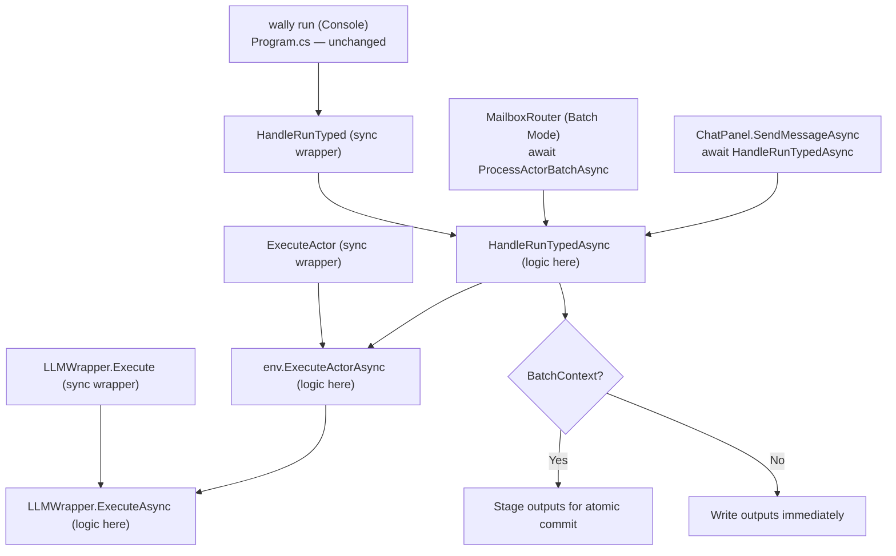

# Async Execution Path — Proposal

*Template: [../../Templates/ProposalTemplate.md](../../Templates/ProposalTemplate.md)*

---

## Problem Statement

`LLMWrapper.RunProcess` synchronously blocks the calling thread for the entire LLM call duration. Every layer above inherits this block. `ChatPanel` works around it with `Task.Run`, which offloads the block to a thread-pool thread but does not make the call genuinely async, and splits cancellation handling across two layers.

---

## Resolution

Add `ExecuteAsync` / `ExecuteActorAsync` / `ExecutePromptAsync` / `HandleRunTypedAsync` async methods at each layer. Sync methods become one-line `GetAwaiter().GetResult()` wrappers — no logic is duplicated and no existing call site changes. `ChatPanel` drops its `Task.Run` wrapper and `await`s directly. **Async execution integrates with batch mailbox processing for stable multi-actor concurrency.**

---

## Related Proposals

| Proposal | Relationship | Notes |
|----------|--------------|-------|
| [AutonomousBotGapsProposal](./AutonomousBotGapsProposal.md) | Parent | Extracted from parent as Phase 1 |
| [AutonomyLoopProposal](./AutonomyLoopProposal.md) | Depended on by | Agent loop builds on the async path |
| [MailboxProtocolProposal](./MailboxProtocolProposal.md) | **Enables** | **Mailbox dispatch uses `ExecuteActorAsync` with batch coordination** |

---

## Phase 1 — Async Execution (Effort: S)

### Design Principles

- **Console stays simple.** `wally run "..."` continues to work with a single synchronous call — no `async Main` visible to the caller.
- **No duplicated logic.** Async path is the single implementation; sync path is a one-line wrapper.
- **No new dependencies.** Pure .NET 8 `Task`/`async`/`await`.
- **Cancellation flows end-to-end.** The same `CancellationToken` the user passes in is the token that kills the child process — no `CancellationToken.None` in the hot path.
- **Batch-aware concurrency.** **Async methods integrate with mailbox batch processing for stable multi-actor execution.**

### Layer-by-layer Changes

#### Layer 1 — `LLMWrapper` (`Wally.Core/LLMWrappers/LLMWrapper.cs`)

- Add `ExecuteAsync(processedPrompt, sourcePath, model, logger, CancellationToken)` — contains all logic.
- `RunProcessAsync` replaces `RunProcess`: `await process.WaitForExitAsync(cancellationToken)`; `await Task.WhenAll(stdoutTask, stderrTask)`; `process.Kill(entireProcessTree: true)` on cancellation.
- `Execute(...)` becomes: `=> ExecuteAsync(..., cancellationToken).GetAwaiter().GetResult()`

#### Layer 2 — `WallyEnvironment` (`Wally.Core/WallyEnvironment.cs`)

- Add `ExecutePromptAsync(prompt, modelOverride, wrapperOverride, loopName, iteration, skipHistory, CancellationToken)` — contains all logic.
- **Add `ExecuteActorAsync(actor, prompt, modelOverride, wrapperOverride, loopName, iteration, skipHistory, CancellationToken)` — contains all logic, integrates with `BatchContext` for staged output handling.**
- `ExecutePrompt(...)` and `ExecuteActor(...)` become one-line `GetAwaiter().GetResult()` wrappers.

**Batch Integration in `ExecuteActorAsync`**:
```csharp
public async Task<string> ExecuteActorAsync(Actor actor, string prompt, 
    string? modelOverride = null, string? wrapperOverride = null, 
    string? loopName = null, int iteration = 0, bool skipHistory = false,
    CancellationToken cancellationToken = default)
{
    // Check if we're in a batch context
    var batchContext = BatchContext.Current;
    
    // Execute actor with LLM
    string response = await wrapper.ExecuteAsync(processedPrompt, SourcePath, model, logger, cancellationToken).ConfigureAwait(false);
    
    // Process action blocks with batch-aware staging
    if (batchContext != null)
        response = actor.PerformActionsBatch(response, this, batchContext);
    else
        response = actor.PerformActions(response, this);
    
    return response;
}
```

#### Layer 3 — `WallyCommands` (`Wally.Core/WallyCommands.cs`)

- **Add `HandleRunTypedAsync(env, prompt, actorName, model, loopName, wrapper, noHistory, CancellationToken)` — contains all logic, batch-context aware.**
- Add `RunPipelineAsync(env, prompt, loopDef, loopLabel, model, wrapper, noHistory, CancellationToken)` — contains all logic.
- `HandleRunTyped(...)` becomes: `=> HandleRunTypedAsync(...).GetAwaiter().GetResult()`

**Batch-Aware Pipeline Processing**:
```csharp
public static async Task<WallyRunResult> HandleRunTypedAsync(WallyEnvironment env, string prompt, 
    string? actorName = null, string? model = null, string? loopName = null, 
    string? wrapper = null, bool noHistory = false, CancellationToken cancellationToken = default)
{
    // Single actor execution (may be part of larger batch)
    if (!string.IsNullOrEmpty(actorName))
    {
        var actor = env.Workspace!.Actors.FirstOrDefault(a => string.Equals(a.Name, actorName, StringComparison.OrdinalIgnoreCase));
        if (actor == null) return WallyRunResult.Error($"Actor '{actorName}' not found");
        
        string response = await env.ExecuteActorAsync(actor, prompt, model, wrapper, loopName, 0, noHistory, cancellationToken).ConfigureAwait(false);
        return new WallyRunResult { ActorName = actorName, Response = response };
    }
    
    // Pipeline execution (batch coordination handled internally)
    return await RunPipelineAsync(env, prompt, loopDef, loopLabel, model, wrapper, noHistory, cancellationToken).ConfigureAwait(false);
}
```

#### Layer 4 — `ChatPanel` (`Wally.Forms/Controls/ChatPanel.cs`)

Replace `Task.Run` wrapper with a direct `await`:

- **Before**: `await Task.Run(() => WallyCommands.HandleRunTyped(..., token), token)`
- **After**: `await WallyCommands.HandleRunTypedAsync(..., cancellationToken: token)`

**UI Integration Note**: `ChatPanel` uses immediate processing (not batch mode) for responsive single-user interactions. Batch processing is reserved for daemon mode and multi-actor scenarios.

#### **New Layer — Batch Coordination** (`Wally.Core/Mailbox/`)

**`BatchContext.cs`** — Thread-local context for batch processing:
```csharp
public class BatchContext
{
    private static readonly ThreadLocal<BatchContext?> _current = new();
    public static BatchContext? Current => _current.Value;
    
    public static IDisposable Enter(BatchContext context)
    {
        _current.Value = context;
        return new BatchScope();
    }
    
    private class BatchScope : IDisposable
    {
        public void Dispose() => _current.Value = null;
    }
    
    // Staged message handling for atomic commit
    public void StageMessage(WallyMessage message) { /* ... */ }
    public List<WallyMessage> GetStagedMessages() { /* ... */ }
}
```

**`MailboxRouter.cs`** — Batch-aware actor processing:
```csharp
public async Task ProcessActorBatchAsync(Actor actor, List<WallyMessage> messages, BatchContext batchContext, CancellationToken cancellationToken)
{
    using var _ = BatchContext.Enter(batchContext);
    
    foreach (var message in messages)
    {
        try
        {
            // Async execution with batch context
            string response = await env.ExecuteActorAsync(actor, message.Body, cancellationToken: cancellationToken).ConfigureAwait(false);
            
            // Response handling staged for batch commit
            batchContext.StageResponse(actor, message, response);
        }
        catch (Exception ex)
        {
            batchContext.StageFailure(actor, message, ex);
        }
    }
}
```

### Call Graph After Phase 1 (with Batch Integration)

```
Wally.Console/Program.cs          (unchanged)
  ? WallyCommands.HandleRun       (unchanged sync signature)
      ? HandleRunTyped            (sync wrapper — unchanged signature)
          ? HandleRunTypedAsync   (new — contains all logic, batch-aware)
              ? env.ExecuteActorAsync   (new — contains all logic, BatchContext integration)
                  ? wrapper.ExecuteAsync (new — contains all logic)

Wally.Forms/ChatPanel.cs (Single-user immediate mode)
  ? await HandleRunTypedAsync     (direct await, no Task.Run, no batch context)
      ? env.ExecuteActorAsync
          ? wrapper.ExecuteAsync

Wally.Core/Mailbox/MailboxRouter.cs (Multi-actor batch mode)
  ? BatchContext.Enter(batchContext)
  ? Parallel: await ProcessActorBatchAsync(actorA), await ProcessActorBatchAsync(actorB)
      ? env.ExecuteActorAsync (with BatchContext.Current)
          ? wrapper.ExecuteAsync
          ? actor.PerformActionsBatch (staged outputs)
  ? BatchContext.CommitStagedMessages()
```

### Cancellation with Batch Processing

`CancellationToken` passed from `ChatPanel` or `MailboxRouter` travels to `process.Kill` with no intermediate `CancellationToken.None`. **Batch processing enhances cancellation**:

- **Individual actor cancellation**: One actor's cancellation doesn't affect others in the batch
- **Batch-wide cancellation**: Batch coordinator can cancel entire iteration while preserving individual actor state
- **Staged output cancellation**: If cancellation occurs during processing, staged outputs are discarded (not committed)

### `ConfigureAwait` Policy

All `await` calls inside `Wally.Core` use `.ConfigureAwait(false)`. `ChatPanel` (UI project) does not, so continuations resume on the UI thread. **Batch processing uses `ConfigureAwait(false)` throughout** since it runs in background contexts without `SynchronizationContext`.

---

## Impact

| File / System | Change | Batch Integration |
|---|---|---|
| `Wally.Core/LLMWrappers/LLMWrapper.cs` | Add `ExecuteAsync`; `Execute` becomes one-line wrapper | **Compatible with batch `CancellationToken` handling** |
| `Wally.Core/WallyEnvironment.cs` | Add `ExecuteActorAsync`, `ExecutePromptAsync`; sync methods become wrappers | **`ExecuteActorAsync` integrates with `BatchContext`** |
| `Wally.Core/WallyCommands.cs` | Add `HandleRunTypedAsync`, `RunPipelineAsync`; sync methods become wrappers | **Batch-context aware for multi-actor scenarios** |
| `Wally.Forms/Controls/ChatPanel.cs` | `await HandleRunTypedAsync(...)` replaces `Task.Run` wrapper | **Single-user immediate mode (no batching)** |
| **`Wally.Core/Mailbox/BatchContext.cs`** | **New — batch processing coordination** | **New component** |
| **`Wally.Core/ActionDispatcher.cs`** | **Enhanced with batch-aware message staging** | **Staged outputs during batch processing** |
| `Wally.Console/Program.cs` | **Unchanged** | **Unchanged** |

---

## Benefits

- **UI thread never blocks**; `ChatPanel` cancellation propagates end-to-end to `process.Kill`.
- **`async`/`await` composable throughout** — required foundation for Phase 2 agent loops and Phase 3 mailbox protocol.
- **Console and runbook behaviour identical** to pre-Phase-1.
- **Stable multi-actor concurrency**: Async execution integrates with batch processing for race-condition-free actor coordination.
- **Scalable processing**: Multiple actors can process messages concurrently using async I/O without blocking threads.
- **Enhanced cancellation**: Fine-grained cancellation control across individual actors and batch operations.

---

## Risks

- **Sync-over-async deadlock** — only occurs when async code captures a `SynchronizationContext` and then blocks waiting for it. **Mitigation**: `.ConfigureAwait(false)` throughout `Wally.Core`; the library has no `SynchronizationContext`. **Batch processing runs in background contexts.**
- **`WaitForExitAsync` does not kill the process on cancel** — an explicit `process.Kill(entireProcessTree: true)` is still required in the `catch` block before rethrowing.
- **Batch context complexity** — **New risk**: Batch processing adds complexity to async execution paths. **Mitigation**: Clear separation between single-user (immediate) and multi-user (batch) execution modes; comprehensive testing of batch coordination.
- **Memory usage during large batches** — **New risk**: Concurrent async operations may consume more memory. **Mitigation**: Configurable batch size limits; monitoring of async operation memory usage.

---

## What Does Not Change

| Item | Status | Batch Context |
|---|---|---|
| `wally run "..."` from terminal | Unchanged — calls sync `HandleRun` | **No batching for console commands** |
| Runbook execution | Unchanged — `HandleRunbook` remains sync | **Individual runbook steps may use batch processing internally** |
| `WallyCommands.DispatchCommand` | Unchanged | **Unchanged** |
| Interactive REPL loop in `Program.cs` | Unchanged | **No batching for interactive commands** |
| `WallyPipeline` (`WallyLoop.cs`) | Unchanged | **Pipeline steps may participate in batch processing** |
| `Actor`, `ActionDispatcher`, history logic | Unchanged — only the async wrapper is new | **ActionDispatcher enhanced with batch staging** |

---

## Integration with Mailbox Protocol

The async execution path provides the foundation for stable multi-actor mailbox processing:

### **Single-User Mode** (ChatPanel)
```csharp
// Immediate processing for UI responsiveness
string response = await WallyCommands.HandleRunTypedAsync(env, prompt, actorName, cancellationToken: token);
// No BatchContext — messages written immediately
```

### **Multi-Actor Batch Mode** (MailboxRouter)
```csharp
// Batch processing for stable concurrency
using var batchScope = BatchContext.Enter(batchContext);

var actorTasks = actors.Select(actor => 
    ProcessActorBatchAsync(actor, batchMessages[actor.Name], batchContext, cancellationToken));
    
await Task.WhenAll(actorTasks); // Concurrent async execution

await batchContext.CommitStagedMessagesAsync(cancellationToken); // Atomic output
```

### **Cancellation Coordination**
- **Single-user**: Direct cancellation from UI to LLM process
- **Batch mode**: Coordinated cancellation across multiple concurrent actors
- **Failure isolation**: One actor's failure/cancellation doesn't corrupt others' processing

---

## Mermaid Diagrams



```mermaid
sequenceDiagram
    participant UI as ChatPanel (Single User)
    participant MR as MailboxRouter (Multi-Actor)
    participant BC as BatchContext
    participant EA as ExecuteActorAsync
    participant LLM as LLMWrapper.ExecuteAsync

    Note over UI: SINGLE-USER MODE
    UI->>EA: await ExecuteActorAsync(actor, prompt, token)
    EA->>LLM: await ExecuteAsync(prompt, token)
    LLM-->>EA: response
    EA->>EA: PerformActions (immediate write)
    EA-->>UI: final response

    Note over MR: MULTI-ACTOR BATCH MODE
    MR->>BC: BatchContext.Enter(batchContext)
    
    par Concurrent Execution
        MR->>EA: await ExecuteActorAsync(actorA, prompt, token)
        EA->>LLM: await ExecuteAsync(prompt, token)  
        LLM-->>EA: responseA
        EA->>BC: Stage outputsA
    and
        MR->>EA: await ExecuteActorAsync(actorB, prompt, token)
        EA->>LLM: await ExecuteAsync(prompt, token)
        LLM-->>EA: responseB
        EA->>BC: Stage outputsB
    end
    
    MR->>BC: await CommitStagedMessagesAsync()
    BC->>BC: Atomic write all staged outputs
    MR->>BC: BatchContext.Exit()
