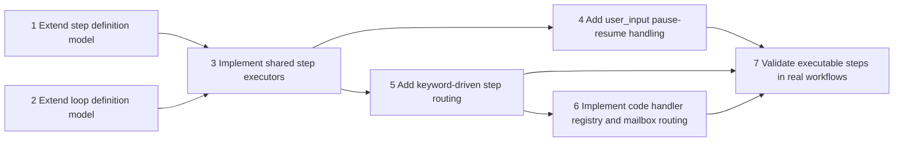

# Executable Loop Steps Proposal - Task Tracker

**Source Proposal**: [ExecutableLoopStepsProposal.md](./ExecutableLoopStepsProposal.md)
**Status**: Active
**Created**: 2026-03-29
**Last Updated**: 2026-04-02
**Owner**: @developer

*Template: [../../Templates/TaskTrackerTemplate.md](../../Templates/TaskTrackerTemplate.md)*

## Summary

This tracker covers the seven tasks required to add typed executable steps, keyword-driven routing, and the first built-in code handler to Wally; Tasks 1-6 are complete, Task 7 is in progress, and the shared loop execution-state abstraction now allows executable-step loops to opt into resumable checkpointing when they need it.

## Task List

#### Phase 1: Finalize typed step model, abilityRefs, and keyword-driven routing fields

| # | Task | Description | Priority | Effort | Status | Owner | Dependencies | Done-Condition |
|---|------|-------------|----------|--------|--------|-------|--------------|----------------|
| 1 | Extend step definition model | Add step kind, abilityRefs, document input metadata, handler metadata, keyword routing fields, and default routing fields to Wally.Core/WallyStepDefinition.cs so loop steps can express prompt, shell, command, code, and user_input execution. | High | 1d | Complete | @developer | - | WallyStepDefinition.cs can represent every step kind and routing field described by the proposal without relying on ad hoc JSON properties. |
| 2 | Extend loop definition model | Add the named-step start and routing metadata needed by dynamic loops to Wally.Core/WallyLoopDefinition.cs while keeping existing single-shot and pipeline loops compatible. | High | 1d | Complete | @developer | - | WallyLoopDefinition.cs can load named-step loop metadata for executable-step workflows without breaking legacy loop definitions. |

#### Phase 2: Implement shared execution routing for prompt, shell, command, code, and user_input

| # | Task | Description | Priority | Effort | Status | Owner | Dependencies | Done-Condition |
|---|------|-------------|----------|--------|--------|-------|--------------|----------------|
| 3 | Implement shared step executors | Route prompt, shell, command, code, and user_input steps through shared execution paths in Wally.Core/commands/WallyCommands.Run.cs and reusable helpers extracted from Wally.Core/commands/WallyCommands.Runbook.cs. | High | 2d | Complete | @developer | 1, 2 | Each declared step kind executes through a shared runtime path rather than bespoke per-loop logic. |
| 4 | Add user_input pause-resume handling | Implement the user_input step kind so loops can persist an interaction request, pause safely, and resume after the user's answer is written back into workflow state. | High | 1d | Complete | @developer | 3 | A user_input step can pause execution and later resume from persisted state without hidden prompt carry-over. |

#### Phase 3: Implement keyword-driven step selection in the loop runtime

| # | Task | Description | Priority | Effort | Status | Owner | Dependencies | Done-Condition |
|---|------|-------------|----------|--------|--------|-------|--------------|----------------|
| 5 | Add keyword-driven step routing | Implement keyword scanning, route lookup, and default fallback behavior in Wally.Core/WallyAgentLoop.cs and Wally.Core/commands/WallyCommands.Run.cs so loops can branch between named steps. | High | 1d | Complete | @developer | 3 | The loop runtime can choose the next named step from a step result keyword or an explicit default fallback. |

#### Phase 4: Implement route_messages as the first built-in code handler

| # | Task | Description | Priority | Effort | Status | Owner | Dependencies | Done-Condition |
|---|------|-------------|----------|--------|--------|-------|--------------|----------------|
| 6 | Implement code handler registry and mailbox routing | Add a built-in handler registry plus the first route_messages handler under Wally.Core/Mailbox/ so code steps can move messages from Outbox to their next location using workflow-owned routing. | High | 1d | Complete | @developer | 5 | A code step can resolve a named handler and route mailbox messages without a separate always-on service. |

#### Phase 5: Wire executable steps and reusable abilities into at least one loop and one runbook use case

| # | Task | Description | Priority | Effort | Status | Owner | Dependencies | Done-Condition |
|---|------|-------------|----------|--------|--------|-------|--------------|----------------|
| 7 | Validate executable steps in real workflows | Wire the new executable-step model and abilityRefs support into Wally.Core/Default/Loops/InvestigationLoop.json and at least one Wally.Core/Default/Runbooks/*.wrb scenario to prove the abstraction works outside a synthetic example. | Medium | 1d | In Progress | @developer | 4, 5, 6 | At least one loop and one runbook use the shared step model successfully, and both validate the typed execution path in real workspace artifacts. |

## Task State Rules

- Every new task starts as `Not Started`.
- A task may move from `Not Started` to `In Progress` only when every listed dependency is `Complete`.
- A task moves to `Blocked` when execution cannot responsibly continue.
- When a task is `Blocked`, review its declared dependencies first before introducing a new blocker explanation.
- When all dependencies for a blocked or not-started task are complete, that task becomes eligible to start.
- A task may move to `Complete` only when its done-condition has been verified.
- `Blocked` is a recoverable state, not a terminal state for the tracker.

## Dependency Rules

- Every task defines a `Dependencies` value.
- `-` means the task has no prerequisites.
- Dependencies use task numbers.
- A dependency is declared only when one task truly cannot begin until another is complete.
- Execution should focus on one eligible task at a time.

## Dependency Map

## Progress Summary

| Phase | Total | Done | Active | Blocked | Remaining |
|-------|-------|------|--------|---------|-----------|
| Phase 1 | 2 | 2 | 0 | 0 | 0 |
| Phase 2 | 2 | 2 | 0 | 0 | 0 |
| Phase 3 | 1 | 1 | 0 | 0 | 0 |
| Phase 4 | 1 | 1 | 0 | 0 | 0 |
| Phase 5 | 1 | 0 | 1 | 0 | 0 |
| **Total** | **7** | **6** | **1** | **0** | **0** |
