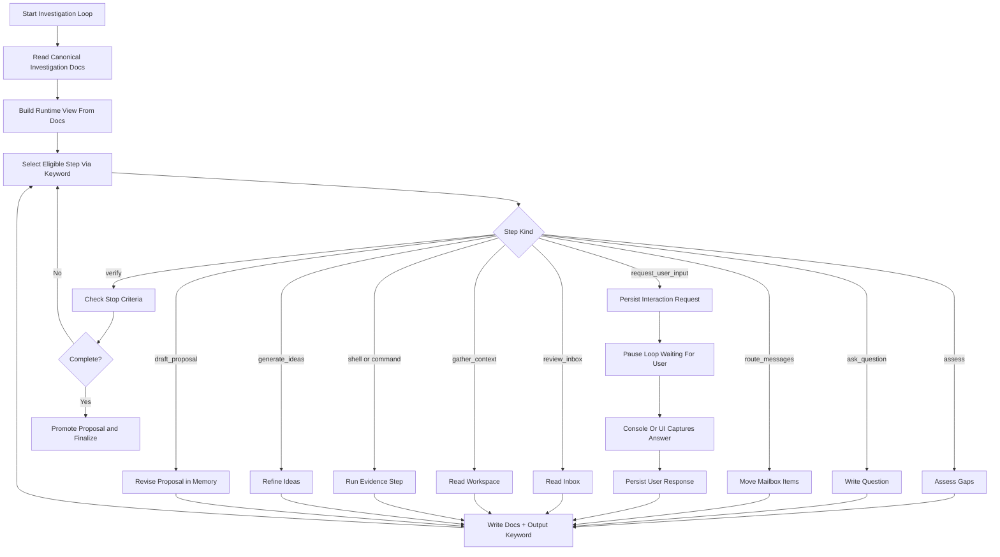

# Investigation Loop Proposal

**Status**: Draft
**Author**: System Architecture Team
**Created**: 2026-03-28
**Last Updated**: 2026-04-04

*Template: [../../Templates/ProposalTemplate.md](../../Templates/ProposalTemplate.md)*

---

## Problem Statement

Wally currently has useful pieces for iterative work, but none of them match the desired investigation workflow:

- JSON loops support fixed ordered steps or a generic single-actor iteration loop.
- Agent loops iterate by feeding one response into the next prompt.
- Script runbooks execute `shell`, `loop { }`, `call`, and `open`, but they are authored workflows, not stateful investigations.
- Actors already have private `Inbox`, `Outbox`, `Pending`, `Active`, and `Memory` folders, but the removed mailbox runtime means folder existence does not currently equal an operational investigation system.

The desired model is different. Wally needs an `InvestigationLoop` that investigates the user's request, develops ideas, asks follow-up questions, updates investigation documents, consults memory, gathers evidence via commands or shell, and converges on one or more proposal documents. The conceptual workflow role is still "investigator", but the initial loop execution should be actor-agnostic.

The loop must also support iterative user interaction through the console and chat UI. During investigation, the application must be able to request a text response from the user, pause the loop, persist the request in documentation, accept the user's answer later, persist that answer, and then resume the investigation from documentation plus loop state. This interaction model is required because the AI execution model is one-shot.

The strongest architectural constraint is prompt execution model: Wally is using one-shot prompts. Prompt state is not a reliable transport layer between iterations. Therefore every loop iteration must reconstruct context from persisted documentation, not from accumulated prompt text. If an investigation fact, open question, hypothesis, decision, or proposal draft matters across iterations, it must exist in documentation on disk before the next loop turn begins.

Without that rule, the investigation loop will become nondeterministic, fragile, and impossible to resume or audit.

---

## Resolution

Introduce a first-class investigation workflow built from three things:

1. `Investigation` workflow role: the research-and-proposal authoring behavior, expressed through loop logic rather than actor injection in v1.
2. `InvestigationLoop`: a JSON loop definition that arranges investigation steps using the existing loop and step infrastructure.
3. Documentation-first investigation state: canonical Markdown files stored under the actor's folder and workspace.

Core decisions:

- The loop is named `InvestigationLoop`.
- `InvestigationLoop` is a JSON loop definition � not a dedicated loop engine or new loop type. JSON loop definitions are the standard way to compose different loop profiles in Wally. A JSON loop can arrange steps that call LLMs, run command-line prompts, execute programmatic handlers, or request user input.
- v1 loop execution is actor-agnostic. No actor role, criteria, or intent prompt should be injected for these beginning loops.
- Prompt construction is template-driven. Each named Wally step owns its own prompt template and any document inputs it requires.
- Steps remain step-owned and customizable. A step may be fully custom, or it may keep its own step-local configuration while also referencing one or more reusable abilities through `abilityRefs`.
- Wally abilities are reusable, documentation-first workflow capabilities that named steps can reference through `abilityRefs`.
- Loops reference specific named Wally steps and route between those step names.
- Every iteration is one-shot and must reload its state from documentation.
- Documentation is the source of truth; any in-memory runtime object is a cache of docs, never the authority.
- The loop may use prompt, shell, command, code, and user-input steps, but all meaningful outputs must be written back to documentation before the iteration ends.
- Inbox, Outbox, Pending, Active, and Memory folders are part of the investigation contract.
- v1 must not depend on a separate mailbox daemon or router service.
- Mailbox movement should instead be performed by executable Wally steps inside the loop or runbook that owns the workflow.
- If mailbox or memory behavior needs additional runtime work, that behavior must first be documented as file contracts and step responsibilities in the proposal docs.
- The loop must support `WaitingForUser` as a first-class paused state.
- User questions and answers must be persisted so the console and Forms chat UI can resume the loop without hidden prompt carry-over.
- Loop execution-state persistence must be a shared loop-runtime capability, not an InvestigationLoop-specific one-off, so any loop can opt into resumable checkpointing when needed.

The investigation loop produces two primary outcomes:

- proposal documents that define concrete recommended approaches
- idea documents or sections that capture alternatives, hypotheses, and deferred options discovered during investigation

The investigation loop may also perform operational workspace steps, such as moving mailbox messages from `Outbox/` to their next destination, when that movement is required for the investigation workflow to continue.

## Canonical Workflow Placement

`InvestigationLoop` is the first loop in the broader Wally workflow, but this proposal only defines loop 1.

Scope rules:

- this proposal covers investigation, questioning, evidence gathering, and proposal authoring
- downstream decomposition and execution workflows are separate concerns
- implementation plans and execution plans are not part of the current default workflow
- the user may move between loops manually in v1; automatic loop-to-loop transition is deferred

## Shared Loop Execution State

Resumable loop execution is now a shared runtime concept.

Design rules:

- loops may opt into persisted execution-state checkpointing through top-level loop metadata rather than relying on loop-specific runtime classes
- the execution-state document records the loop name, run id, status, current step, next step, iteration count, current resumable prompt, and the last step result
- starting a fresh run with a new prompt may clear loop-specific transient artifacts declared by that loop before the new execution-state document is written
- InvestigationLoop still owns its domain artifacts such as `InteractionState.md`, `LatestUserResponse.md`, and `UserResponses.md`, but resume mechanics come from the shared loop execution-state contract
- promptless resume should only be available when a loop explicitly opts into execution-state persistence
- every interactive surface must consume the same shared execution-state contract; WinForms manual stepping may be the first rich operator surface, but future Console step-by-step support must reuse the same core semantics instead of inventing a second runtime model
- prompt preview, diagram preview, and other inspection-only flows must be read-only; they may inspect the current step and render equivalent commands, but they must not prepare, mutate, or advance persisted execution state
- equivalent CLI commands shown by a UI surface are operator-facing display artifacts unless explicitly dispatched through the shared run path; showing a command must never cause a second hidden execution

### Simple Resume Semantics

Loop continuation is part of the shared loop-runtime contract, not InvestigationLoop-specific runtime logic.

High-level rules:

- execution is resumable from persisted state, not transactionally reversible
- a step is usable for continuation only after required document writes and the matching state update are persisted
- fresh run, pause, resume, and preview are the only required controls in v1
- user-response recording updates investigation docs and then resumes from shared execution state

The detailed state shape and lifecycle rules live in [Loop Resume Contract](../../Docs/LoopResumeContract.md).

---

## Keyword-Driven Step Selection

**This is a fundamental design requirement.** Each loop step must use keywords in the LLM response (or programmatic result) to determine what the next `WallyStep` should be.

A WallyStep may be:

- **An AI prompt step** � the LLM response contains a keyword that selects the next step (e.g. `NEED_USER_INPUT`, `DRAFT_READY`, `INVESTIGATE_MORE`)
- **A user input step** � the loop pauses for user input and resumes after the answer is persisted
- **A programmatic step** � a built-in runtime handler (e.g. `route_messages`, `record_user_response`) that runs code, not an LLM call

The loop definition JSON declares which keywords map to which next step names. The loop runtime reads the keyword from the previous step's output and dispatches accordingly. This is how a JSON loop definition becomes a dynamic, branching workflow without requiring a custom loop engine.

This keyword-driven model applies to all Wally loops, not just the investigation loop. It is the standard mechanism for step-to-step routing.

---

## Template-Driven Prompt Construction

The investigation workflow should not rely on one fixed runtime prompt composer. It should be template-driven at the Wally-step level.

Design rules:

- each named `WallyStepDefinition` owns its own custom prompt text
- each step definition declares the documentation inputs it needs
- each step may optionally reference reusable abilities through `abilityRefs`, but those ability references augment the step rather than replacing its step-local configuration
- the loop references step names and routing rules, not a hidden hardcoded prompt builder
- the runtime resolves the active step, loads the required docs for that step, expands the step template, executes the step, and then routes to the next step by keyword

Recommended v1 storage model:

- keep step definitions inside the loop JSON as named `Steps`
- each step must have a stable `Name`
- keyword routing and default routing refer to those step names
- no separate global step registry is required for v1
- if reusable mailbox or memory behaviors emerge later, document them first and then extract them intentionally rather than introducing hidden shared behavior

For investigation work, the prompt should be built from the active step definition plus persisted docs, not from the previous LLM response alone.

Recommended prompt-template inputs for step definitions:

- `{userPrompt}`: the original request that started the investigation
- `{previousStepResult}`: the previous step result when a step explicitly wants it
- `{InvestigationBrief}`: contents of `Docs/InvestigationBrief.md`
- `{OpenQuestions}`: contents of `Docs/OpenQuestions.md`
- `{Findings}`: contents of `Docs/Findings.md`
- `{Ideas}`: contents of `Docs/Ideas.md`
- `{InteractionState}`: contents of `Docs/InteractionState.md`
- `{UserResponses}`: contents of `Docs/UserResponses.md`
- `{ActiveItem}`: current active investigation item or thread
- `{MemorySummary}`: the memory summary or selected memory digest for the step
- `{AbilityBlocks}`: resolved ability guidance blocks from any referenced abilities

The important rule is not the exact placeholder list. The important rule is that the prompt comes from the step's template and persisted documentation inputs. If a step does not declare a document input, the runtime should not inject it implicitly.

Customization rules:

- a custom-only step may omit `abilityRefs` entirely
- an ability-augmented step may include `abilityRefs` and still provide its own step-specific prompt text, document inputs, routes, and execution settings
- abilities supply reusable guidance blocks; the step definition still owns the final shape of the step
- if `abilityRefs` is present and `{AbilityBlocks}` is omitted, the runtime should prepend the resolved ability guidance rather than silently dropping it

This keeps the behavior inspectable: a reviewer can look at a loop definition, look at a step definition, and understand what text is being sent to the model.

---

## Abilities

Wally should treat abilities as reusable workflow capabilities.

Design rules:

- an ability is a named, documentation-first capability that a loop step can reference
- actors may still declare abilities for authorization purposes, but loop `abilityRefs` are independent from actor prompt injection
- a step may stay fully custom or may add `abilityRefs` on top of its own step-local configuration
- in v1, ability execution is loop-owned and actor-agnostic
- ability documents define the reusable guidance; step definitions decide when that guidance is applied

Recommended v1 documentation model:

- define ability documents under `Abilities/`
- author ability documents using `Templates/AbilityTemplate.md`
- reference abilities from step JSON by stable name using `abilityRefs`

Recommended prompt-assembly rule for `abilityRefs`:

1. resolve the referenced ability documents in declared order
2. extract their reusable guidance blocks
3. combine those blocks into `{AbilityBlocks}`
4. expand the step's own `promptTemplate`
5. execute the resulting step prompt in direct mode unless the step explicitly opts into actor-backed execution later

This keeps abilities reusable without hiding execution logic. The ability defines reusable loop knowledge; the step still owns the final prompt and routing behavior.

Required ownership rule:

- the step owns its `kind`, document inputs, routes, handler settings, and any step-specific prompt text
- `abilityRefs` is optional and additive
- reusable abilities must never become an implicit global prompt layer outside the active step definition

Canonical JSON conventions for v1:

- use `camelCase` property names in proposal docs and shipped examples
- loading may remain case-insensitive for backward compatibility, but new definitions should use one canonical style
- named-step loops use `startStepName` plus `steps`; legacy `startPrompt` and `feedbackMode` should not be the primary control surface for this workflow

---

## Proposed InvestigationLoop JSON Shape

Recommended top-level JSON shape for named-step investigation loops:

```json
{
    "name": "InvestigationLoop",
    "description": "Investigates a request, asks follow-up questions, gathers evidence, and produces proposal artifacts.",
    "enabled": true,
    "startStepName": "assessState",
    "executionState": {
        "enabled": true,
        "statePath": "Actors/Investigator/Active/CurrentInvestigation/ExecutionState.md",
        "resetPathsOnNewRun": ["Actors/Investigator/Active/CurrentInvestigation"],
        "preservePathsOnReset": ["Actors/Investigator/Active/CurrentInvestigation/README.md"]
    },
    "maxIterations": 24,
    "stopKeyword": "INVESTIGATION_COMPLETE",
    "steps": [
        {
            "name": "assessState",
            "description": "Read the canonical docs, assess gaps, and choose the next action.",
            "kind": "prompt",
            "abilityRefs": ["investigation-assessment"],
            "promptTemplate": "Assess the current investigation state using the loop rules below.\n\nAbility Guidance:\n{AbilityBlocks}\n\nOriginal request:\n{userPrompt}\n\nBrief:\n{InvestigationBrief}\n\nOpen Questions:\n{OpenQuestions}\n\nFindings:\n{Findings}\n\nIdeas:\n{Ideas}\n\nReturn one routing keyword and the required document updates.",
            "documentInputs": [
                { "key": "InvestigationBrief", "path": "Actors/Investigator/Docs/InvestigationBrief.md", "required": true },
                { "key": "OpenQuestions", "path": "Actors/Investigator/Docs/OpenQuestions.md", "required": false },
                { "key": "Findings", "path": "Actors/Investigator/Docs/Findings.md", "required": false },
                { "key": "Ideas", "path": "Actors/Investigator/Docs/Ideas.md", "required": false }
            ],
            "writesToDocs": [
                "Actors/Investigator/Docs/InvestigationLog.md",
                "Actors/Investigator/Docs/OpenQuestions.md"
            ],
            "keywordRoutes": {
                "GATHER_CONTEXT": "gatherContext",
                "NEED_USER_INPUT": "requestUserInput",
                "GENERATE_IDEAS": "generateIdeas",
                "DRAFT_PROPOSAL": "draftProposal",
                "COMPLETE": "complete"
            },
            "defaultNextStep": "gatherContext"
        }
    ]
}
```

Field rules:

- `name`: unique loop name used by `run -l`
- `description`: human-readable summary shown in list surfaces
- `enabled`: whether the loop is selectable
- `startStepName`: the first named step to execute for this loop
- `executionState`: optional shared loop-runtime checkpoint settings for resumable loops
- `maxIterations`: hard safety limit for the loop runtime
- `stopKeyword`: optional emergency stop keyword; not the primary completion mechanism
- `steps`: ordered collection of named step definitions stored inside the loop JSON
- `actorName`: optional future default actor; initial investigation loops should omit it and run actor-agnostic
- `abilityRefs`: optional per-step ability references; omitting them keeps the step fully custom, while including them augments the step with reusable guidance

Compatibility rules:

- existing single-shot and pipeline loops may continue using `startPrompt`, `maxIterations`, and the current step model
- any loop type may opt into `executionState` when it needs resumable checkpointing; opt-in should remain explicit
- named-step investigation loops should prefer `startStepName` plus step-owned templates
- for named-step loops, `feedbackMode` is legacy compatibility only; persisted docs and step templates are the primary prompt inputs

---

## Documentation-First State Model

Because prompts are one-shot, investigation state must be represented as documents on disk. The loop should rebuild its prompt context from these files each time it runs.

Recommended canonical document set for `Actors/Investigator/`:

The current `Actors/Investigator/` path is a storage convention for v1 working state. It does **not** imply that actor role, criteria, or intent prompts are injected into the loop.

| Location | Purpose | Authority |
|----------|---------|-----------|
| `Docs/InvestigationBrief.md` | Restates the user's request, scope, constraints, and success conditions | Canonical |
| `Docs/InvestigationLog.md` | Running chronological log of what the investigator learned and did | Canonical |
| `Docs/OpenQuestions.md` | Active unresolved questions, grouped by blocker severity | Canonical |
| `Docs/Findings.md` | Evidence-backed findings from code, docs, commands, and shell output | Canonical |
| `Docs/Ideas.md` | Candidate approaches, alternatives, and discarded options | Canonical |
| `Docs/InteractionState.md` | Current interactive state, including whether the loop is waiting for a user answer | Canonical |
| `Docs/UserResponses.md` | Chronological log of user answers received during the investigation | Canonical |
| `Abilities/` | Reusable Wally ability documents referenced by loop `abilityRefs` | Canonical for shared loop abilities |
| `Memory/` | Investigator-private working memory files, summaries, durable notes, and in-progress proposal drafts | Canonical for private memory |
| `Inbox/` | Human-curated or tool-curated incoming answers and requests for the investigator | Canonical for inbound messages |
| `Outbox/` | Questions, requests, or handoff messages emitted by the investigator | Canonical for outbound messages |
| `Pending/` | Investigation items acknowledged but not currently active | Derived but persisted |
| `Active/` | The investigation item or thread currently being worked | Derived but persisted |

**Proposal draft location:** Until a proposal is formally ready, the draft lives in the investigator's `Memory/` folder as private working state. When the investigator decides the proposal is ready for review or promotion, it is written to `Projects/Proposals/` as a formal proposal document. The `Memory/` folder is the actor's private workspace; `Projects/Proposals/` is the shared project workspace.

The runtime may maintain a typed model for convenience, but it must be reconstructed from these documents every iteration and written back before completion.

`InteractionState.md` should be a single current-state document, not a running history log. Historical answers belong in `UserResponses.md`. The goal is to keep pause-resume behavior simple and inspectable.

Recommended minimal contract:

- `QuestionBatchId`: stable id for the current user-question batch, or `None` when not waiting
- `AskedAtUtc`: when the current question batch was issued
- `Questions`: ordered list of one or more questions, each with `QuestionId`, `QuestionText`, `Reason`, and `ExpectedAnswerShape`

Execution-state ownership:

- `ExecutionState.md` owns run id, loop status, next step, and resumability
- `InteractionState.md` owns only the current pending question batch
- Console and Forms derive display labels and resume guidance from execution state instead of persisting UI-specific resume metadata into interaction state

Recommended v1 rules:

- only one active waiting question batch per investigation
- `InteractionState.md` describes the current pending batch only
- `InteractionState.md` exists only while the loop is waiting for input
- if there is no pending batch, `InteractionState.md` should be absent
- `UserResponses.md` is the chronological answer ledger
- `LatestUserResponse.md` is a convenience projection of the newest answer batch for prompt inputs that only need the latest clarification
- the loop may ask one question or several related questions in the same batch
- when the answer batch is recorded, `UserResponses.md` and `LatestUserResponse.md` are updated, then `InteractionState.md` is deleted before the loop resumes
- v1 keeps one active investigation workflow in the workspace so follow-up `run` commands can attach implicitly to the current investigation
- UI-specific display details should not be persisted here unless both console and Forms require them

Recommended simple process:

1. The loop determines it cannot continue without user input.
2. It writes the current question batch into `InteractionState.md` and updates any investigation docs needed for unresolved items.
3. The shared execution-state document already records that the loop is now `WaitingForUser` and what step should resume next.
4. Console or Forms reads `InteractionState.md` for the ordered questions and `ExecutionState.md` for the run label and resume context.
5. The user submits one response containing one or more answers.
6. The application appends the answer batch to `UserResponses.md`, refreshes `LatestUserResponse.md`, and deletes `InteractionState.md`.
7. The application resumes the loop using the current execution state.
8. The next one-shot iteration reloads docs, applies the answers to `Findings.md`, `OpenQuestions.md`, or the proposal draft, and either continues investigating or asks the next batch.

Required markdown format for `InteractionState.md`:

- exactly one H1: `# Interaction State`
- exactly one `## Metadata` section with these bullet keys in this order: `QuestionBatchId`, `AskedAtUtc`
- exactly one `## Questions` section
- one `### <QuestionId>` subsection per pending question, in display order
- each question subsection uses exactly these bullet keys: `Text`, `Reason`, `ExpectedAnswerShape`
- the file should exist only while the loop is waiting for input
- after the answer batch is persisted, the file should be deleted before the loop resumes

```md
# Interaction State

## Metadata
- QuestionBatchId: QB-003
- AskedAtUtc: 2026-03-29T18:00:00Z

## Questions

### Q-003
- Text: Which deployment target matters most for v1?
- Reason: The proposal cannot narrow scope until the primary target is explicit.
- ExpectedAnswerShape: free_text

### Q-004
- Text: Are there any hard constraints on hosting or OS support?
- Reason: Platform constraints affect the recommendation.
- ExpectedAnswerShape: bullet_list
```

Required markdown format for `UserResponses.md`:

- exactly one H1: `# User Responses`
- append one `## Batch <QuestionBatchId>` section per recorded answer batch
- under each batch heading, write these bullet keys in this order: `InvestigationId`, `RecordedAtUtc`, `Source`
- one `### <QuestionId>` subsection per question in the original batch order
- the answer body goes directly under the matching question heading as normal markdown paragraphs or lists
- if the user does not answer a question in the batch, write `No answer provided.` under that question heading

```md
# User Responses

## Batch QB-003
- InvestigationId: INV-001
- RecordedAtUtc: 2026-03-29T18:03:00Z
- Source: Console

### Q-003
The primary deployment target is Windows desktop for internal users.

### Q-004
- Windows 11 is required.
- No cloud hosting is needed for v1.
```

## Operational History And UI Transcripts

Canonical investigation state lives in the investigation docs plus shared execution state. Operator transcripts and UI history are separate operational artifacts.

Rules:

- chat-session transcripts belong under workspace history, for example `History/ChatSessions/`, and are operational logs rather than canonical workflow state
- process logs, wrapper conversation history, and UI transcripts may help debugging, but they are not authoritative inputs for the next investigation iteration unless a step explicitly copies needed facts into canonical docs
- Console and Forms must render waiting state, run labels, and resume guidance from `ExecutionState.md` plus `InteractionState.md`, not from surface-specific hidden metadata
- WinForms manual stepping and any future Console step-by-step mode must call the same shared typed-step execution path in Core
- the existence of a transcript log must never be treated as proof that a workflow boundary committed; only canonical docs and execution-state checkpoints can do that

---

## Why The Source Of Truth Must Be Documentation

The investigation loop cannot rely on prompt carry-over or UI memory. If a fact matters after the current step, it must be written to persisted documentation before the next step begins.

In practice this means:

- prompt history is never authoritative
- interactive questions and answers must be persisted before reuse
- drafts, findings, open questions, and operational decisions must live in docs, not transient chat state

That is what makes the workflow resumable, inspectable, and reviewable.

---

## Investigator Role And Actor Integration

The investigator is a conceptual workflow role. In v1, `InvestigationLoop` should run in direct mode with no actor prompt injection. A dedicated `Investigator` actor may still exist later as an optional packaging of the same workflow behavior, but it should not be required for the first implementation.

Responsibilities:

- investigate the user's request and surrounding workspace context
- identify gaps, ambiguities, constraints, and tradeoffs
- generate and maintain open questions
- propose multiple ideas before converging on a recommendation
- author and revise proposal documents in Memory, promoting to Projects/Proposals when ready
- use memory and documentation to carry context between one-shot iterations
- decide when to ask another question, gather more evidence, update docs, or finalize a proposal draft

The investigator is not the implementation actor. Its job is to understand, assess, and propose.

Recommended v1 loop-owned abilities:

- abilities: `investigation-assessment`, `context-gathering`, `alternative-generation`, `proposal-drafting`, `mailbox-routing`, `memory-summarization`
- ability docs authored under `Abilities/` using `Templates/AbilityTemplate.md`
- execution via loop step kinds: `prompt`, `shell`, `command`, `code`, `user_input`

Actors may still have their own `abilities` list for authorization and action execution. That actor-level mechanism should remain separate from loop `abilityRefs`. The beginning loops should focus on loop-owned ability references and direct prompt execution.

The loop, not any actor wrapper, is responsible for deciding when shell, command, code, or user-input execution happens.

---

## Investigation Loop

`InvestigationLoop` is a JSON loop definition. It is not a custom loop engine or a new loop type � it is a JSON arrangement of named steps using the existing `WallyLoopDefinition` and `WallyStepDefinition` infrastructure, extended with keyword-driven step selection, template-driven prompt construction, reusable ability references, and executable step kinds.

This follows the Wally principle that JSON loop definitions are the standard way to compose different workflow profiles. A JSON loop can arrange named steps that call direct prompts, run command-line prompts, execute programmatic handlers, or request user input.

It is not a fixed ordered pipeline. It is a dynamic investigation cycle where keywords in step outputs determine the next eligible step name.

Typical cycle:

1. Load `InvestigationBrief.md`, `OpenQuestions.md`, `Findings.md`, `Ideas.md`, relevant `Memory/` files, and any `Inbox/` items.
2. Assess what is known, unknown, blocked, and weakly evidenced.
3. Choose the next investigation step name based on keyword output from the previous step.
4. Resolve that step definition, expand its prompt template from the required docs, and execute it.
5. Write all material outputs back into investigation documentation.
6. Reassess whether more questions, more evidence, or more proposal drafting is required.
7. Stop only when the user is satisfied or a hard-stop condition is reached.

If the next step requires user clarification, the loop must:

1. write the interaction request into canonical docs
2. move to `WaitingForUser`
3. return control to the console or UI
4. resume only after the user's answer has been persisted

This loop should be able to revisit the same activity multiple times. Investigation is not linear.

---

## Investigation Step Kinds

The loop should support these step kinds in v1:

| Step Kind | Purpose | Output Requirement |
|-----------|---------|--------------------|
| `assess` | Review existing docs and decide what is missing | Must update `InvestigationLog.md` and optionally `OpenQuestions.md` |
| `ask_question` | Formulate the next question for the user or another actor | Must write the question to `Outbox/` or `Docs/OpenQuestions.md` |
| `review_inbox` | Read incoming answers or requests | Must log what changed in `InvestigationLog.md` |
| `route_messages` | Move mailbox items from `Outbox/` to the next valid location | Must write routing results to `InvestigationLog.md` and update folder state |
| `request_user_input` | Ask the user one or more related questions through console or UI | Must write the request batch to `InteractionState.md` and pause the loop |
| `record_user_input` | Persist one or more user answers into investigation docs | Must append the answer batch to `UserResponses.md` and update `OpenQuestions.md` or `Findings.md` |
| `use_ability` | Apply one or more named abilities to the current step context | Must record which abilities were applied in `InvestigationLog.md` |
| `gather_context` | Read files, docs, workspace structure, and prior artifacts | Must update `Findings.md` |
| `shell` | Execute an OS command for evidence gathering | Must summarize results into docs |
| `command` | Run a Wally command for evidence gathering or orchestration | Must summarize results into docs |
| `update_memory` | Consolidate long-lived investigator notes | Must write to `Memory/` |
| `generate_ideas` | Produce or refine alternative ideas | Must update `Ideas.md` |
| `draft_proposal` | Write or revise the proposal document in Memory | Must update `Memory/ProposalDraft.md` or promote to `Projects/Proposals/` when ready |
| `verify` | Check whether the documented state is sufficient to stop | Must write verification result to `InvestigationLog.md` |
| `complete` | Finalize outputs and stop the loop | Must produce final proposal artifacts and stop reason |

These steps are intentionally documentation-oriented. An iteration that fails to write its new understanding to docs has not completed successfully.

`request_user_input` and `record_user_input` are the bridge between one-shot AI execution and iterative product interaction.

Each step produces a keyword in its output that tells the loop which step to execute next. This is the standard keyword-driven routing model.

Each step definition should also own the text or template that drives that step. In other words, the step definition is where the prompt lives. The loop definition is where routing lives.

Simple ownership model:

- step definition owns: custom text, prompt template, ability refs, execution kind, required docs, and expected outputs
- loop definition owns: which steps exist in the workflow, which step starts first, and how keywords route between step names
- documentation owns: the investigation state, mailbox state, memory state, proposal state, and ability documents used to fill those templates

---

## Proposed Execution Model



The key property is not the scheduler itself. The key property is that the scheduler always acts over persisted documentation, never over hidden conversational residue.

The second key property is pause-resume interaction. The loop is allowed to stop mid-investigation waiting for user input, but only after it has persisted exactly what it needs and why.

The third key property is keyword-driven step selection. Each step outputs a keyword that determines which step runs next, making the loop a dynamic branching workflow expressed in JSON.

---

## Console And Chat UI Interaction Model

The console and Forms chat UI must both support the same loop contract.

Required behavior:

1. The investigation loop can return `WaitingForUser` instead of `Completed`.
2. The runtime exposes the active interaction request from `Docs/InteractionState.md`.
3. The console or chat UI renders the pending question batch to the user.
4. The user submits one response containing one or more answers.
5. The application persists the answers before resuming the loop.
6. The next one-shot investigation iteration reloads documentation and continues.

The loop continues iterating until the user is satisfied. The user may answer questions, provide additional direction, or indicate that the work is complete. The loop does not stop on its own unless a hard-stop condition is reached � the user drives completion.

Console behavior recommendation:

- after a loop iteration returns `WaitingForUser`, print the pending question batch in order
- accept a plain text response from the user in the console, including multi-answer responses when needed
- normalize the response into the required `Docs/UserResponses.md` format and update `Docs/InteractionState.md`
- rerun the investigation loop with the same investigation id or active item

Forms chat behavior recommendation:

- render the pending question batch as a system or workflow message
- keep the normal chat input; no special workflow beyond answering the pending questions is required
- on submit, normalize the answer batch into docs before continuing the loop
- display that the loop resumed from persisted state rather than conversational history

The UI is not the memory. The UI is a transport surface for writing user responses into the documentation set that the next loop iteration will read.

---

## Command Invocation Model

The existing `run` command should remain the canonical user entry point for the investigation workflow. v1 should not introduce a separate `run-loop`, `investigate`, or `answer` verb.

Start a new investigation:

```text
wally run "<request>" -l InvestigationLoop
```

Continue a waiting investigation:

```text
wally run "<answer batch>" -l InvestigationLoop
```

Command contract for v1:

- if there is no active waiting investigation, `run` starts a new investigation
- if the active investigation is in `WaitingForUser`, the next `run` input for `InvestigationLoop` is treated as the answer batch for the current pending questions, not as a brand-new investigation request
- the active investigation is resolved implicitly from the workspace's current `Active/` investigation state
- once the answer batch is persisted, the loop continues automatically
- Console and Forms chat should both use the same command semantics

This keeps the user experience simple: users already know how to run prompts, and the loop runtime decides whether the text is a new request or an answer to the current pending batch.

---

## Inbox, Outbox, Memory, Pending, And Active

The folder model should be treated as part of the investigation runtime contract.

### Inbox

Used for inbound answers, clarifications, or sub-results. In v1, inbox items may be created manually by users or tools. The investigation loop should consume them as documentation inputs.

When an inbox message is consumed, the investigation loop must update the relevant documentation (e.g. `Findings.md`, `OpenQuestions.md`, `InvestigationLog.md`) to reflect the new information. Once the message has been fully processed and its content is reflected in documentation, the message file is deleted from `Inbox/`. Documentation is the durable record � the inbox is a transient delivery surface.

### Outbox

Used for outbound questions, requests, or handoffs. In v1, writing to Outbox is supported conceptually and via `send_message`. Delivery should be performed by an executable Wally step owned by the active workflow, not by assuming a separate always-on router process.

For user-facing questions, Outbox may be used as an audit trail, but `InteractionState.md` should remain the canonical place that the console or UI reads to know whether the loop is waiting for input.

### Memory

Used for investigator-private durable notes and in-progress work. This is where the investigator stores compact summaries, prior conclusions, command-result digests, reusable context, and **in-progress proposal drafts** that should survive between investigation runs.

`Memory/` is private to the actor. It is the actor's own working space. The shared project documentation under `Projects/` is the public workspace where finalized artifacts are promoted. Use common sense: if something is the actor's working notes, it belongs in Memory. If something is a finished artifact intended for the project or other actors, it belongs in the shared project docs.

### Pending

Used for known items that are not currently active. Examples: unanswered questions, deferred idea branches, follow-up research tasks.

### Active

Used for the currently focused thread or active investigation item. This gives the next one-shot prompt a stable place to discover what the investigator is presently doing.

---

## Dynamic Command And Shell Execution

The investigation loop must support dynamic evidence gathering through code and commands.

Execution policy:

- `shell` steps run OS commands in the WorkSource root using the same execution behavior already used by script runbooks.
- `command` steps dispatch Wally commands through the existing command router.
- executable code-backed steps may run built-in runtime handlers such as mailbox routing without requiring a separate service process
- non-zero exit codes do not automatically destroy the investigation; they become documented evidence unless policy marks them fatal
- no shell or command result is considered preserved until it has been written into investigation documentation

Implementation rule: extract shared shell and command execution helpers from script-runbook execution so `InvestigationLoop`, executable loop steps, and script runbooks use one execution stack.

---

## Proposal Output Model

The default end product of an investigation should be:

- one canonical approved proposal document, promoted from `Memory/ProposalDraft.md` to `Projects/Proposals/` when ready
- one ideas document or ideas section capturing alternatives, rejected options, and future directions
- a final investigation summary in `InvestigationLog.md` or a separate summary document

The loop may require several user-answer cycles before those artifacts are complete. The loop continues until the user is satisfied with the output.

The investigator should converge on proposal-quality output, not merely produce notes.

Downstream planning and execution artifacts are outside the scope of this proposal.

---

## Open Questions

No open questions remain for the v1 investigation workflow model. The resolved decisions are listed here for traceability:

1. ~~Should `InvestigationLoop` extend `WallyLoopDefinition` or introduce a dedicated investigation-loop definition type?~~ **Resolved:** `InvestigationLoop` is a JSON loop definition using the existing `WallyLoopDefinition` infrastructure. JSON loops are the standard composition model. No dedicated type needed.
2. ~~Should final proposal documents live under `Projects/Proposals/` by default, or under investigator-owned docs until promoted?~~ **Resolved:** Drafts stay in the investigator's `Memory/` folder as private working state. When the proposal is formally ready, it is promoted to `Projects/Proposals/`.
3. ~~How should `Inbox/` items be marked consumed in v1: filename move, front-matter status, or both?~~ **Resolved:** When an inbox message is consumed, update the relevant documentation to reflect the information. Once the message is fully processed and reflected in docs, delete the message file. Documentation is the durable record.
4. ~~How much raw shell output should be retained in `Memory/` before summarization or truncation?~~ **Removed:** This was overcomplicated and unnecessary. Shell output that matters gets summarized into documentation. Raw output does not need a retention policy � use common sense.
5. ~~Which parts of `Memory/` should be private to the investigator versus promotable into shared docs?~~ **Resolved:** `Memory/` is private to the actor. It is the actor's own working space. The shared project documentation under `Projects/` is the public workspace. If something is the actor's working notes, it belongs in Memory. If something is a finished artifact intended for the project, it belongs in shared docs. Use common sense.
6. ~~Should user responses be persisted directly to canonical docs, to Inbox messages, or to both?~~ **Resolved:** Outputs go where they need to be. Bots are one-shot, so every iteration must have all information it needs available in persisted files. User responses should be written to `UserResponses.md` and any other canonical doc that needs the information for the next iteration to function.
7. ~~What data should be persisted in `InteractionState.md` so that both console and Forms UI can render and resume a paused investigation identically?~~ **Resolved:** Keep `InteractionState.md` as a single current pending-batch document with `QuestionBatchId`, `AskedAtUtc`, and `Questions`. Run id, loop status, and resume mechanics belong to `ExecutionState.md`. Historical answers stay in `UserResponses.md`.
8. ~~Should v1 enforce exactly one active waiting user question per investigation, or allow multiple pending questions at once?~~ **Resolved:** Allow one active waiting batch per investigation. A batch may contain one question or several related questions.
9. ~~After a user answer is persisted, should the application resume the loop automatically, or should it wait for an explicit continue action from the user?~~ **Resolved:** Keep the workflow simple. Once the answer batch is persisted, the application continues the loop.
10. ~~Should the workflow use a dedicated `run-loop` or `answer` command?~~ **Resolved:** No. Reuse the existing `run` command as the canonical entry point for both starting an investigation and answering a pending question batch.
11. ~~Should the user specify the investigation id explicitly on follow-up commands?~~ **Resolved:** No for v1. Resolve the current active investigation implicitly from the workspace state.
12. ~~Should prompt construction use a fixed runtime composer or step-owned templates?~~ **Resolved:** Use template-driven prompt construction. Each named step owns its prompt template and declared document inputs, while the loop routes between step names.
13. ~~Should the first investigation loops be actor-backed or actor-agnostic?~~ **Resolved:** The first investigation loops should be actor-agnostic. No actor role, criteria, or intent prompt should be injected.
14. ~~Should loop steps be able to reference reusable Wally abilities?~~ **Resolved:** Yes. Steps may reference reusable workflow abilities through `abilityRefs`, while still owning their final prompt template and routing behavior.
15. ~~Should approved proposals transition into implementation plans before downstream execution?~~ **Resolved:** No. An extra planning layer is redundant for the current default workflow.
16. ~~Should execution plans orchestrate delivery after proposal approval?~~ **Resolved:** No. An extra execution-plan layer is redundant for the current default workflow.
17. ~~Should Wally automatically transition between loops in v1?~~ **Resolved:** No. The user may start each loop manually. Automation can be added later.
18. ~~Should step-by-step execution be treated as fully transactional?~~ **Resolved:** No. The real v1 need is resumable execution from persisted state, not transactional replay.
19. ~~Do we need explicit replay, retry, or run-from-step controls in v1?~~ **Resolved:** No. Persist enough state to pause and resume reliably. Richer operator controls should be deferred until a concrete use case proves they are necessary.
20. ~~Should WinForms manual stepping keep its own runtime approximation?~~ **Resolved:** No. Manual stepping must reuse the shared typed-step execution path in Core so auto mode, manual mode, and future Console resume behavior stay aligned.
21. ~~Does Console need first-class step-by-step controls immediately?~~ **Resolved:** No. Shared resume behavior is enough for v1.
22. ~~Are chat transcripts canonical investigation state?~~ **Resolved:** No. Chat transcripts are operational history under workspace history folders. Canonical workflow state remains the investigation docs plus execution-state checkpoints.
23. ~~Should prompt previews or equivalent command previews mutate workflow state?~~ **Resolved:** No. Preview paths are read-only inspection flows.
24. ~~Should a UI that displays an equivalent CLI command also dispatch it automatically?~~ **Resolved:** No. Displaying an equivalent command is informational only unless the operator explicitly executes it.

---

## Related Proposals

| Proposal | Relationship | Notes |
|----------|--------------|-------|
| [ThreeLoopWorkflowProposal](./ThreeLoopWorkflowProposal.md) | Parent | Defines the broader workflow sequence that this loop begins |
| [TaskExecutionLoopProposal](./TaskExecutionLoopProposal.md) | Sibling | Defines a downstream execution workflow outside the scope of this proposal |
| [RunbookSyntaxProposal](./RunbookSyntaxProposal.md) | Depends on | Reuse existing `shell` and scripted command execution patterns |
| [AutonomyLoopProposal](../Archive/CompletedProposals/AutonomyLoopProposal.md) | Builds on | Existing agent loop provides the iteration baseline |
| [UnifiedExecutionModelProposal](../Archive/CompletedProposals/UnifiedExecutionModelProposal.md) | Informs | Reuse data-driven validation and action authorization patterns |
| [ExecutableLoopStepsProposal](./ExecutableLoopStepsProposal.md) | Depends on | InvestigationLoop needs reusable code-backed steps such as mailbox routing |

## Related Documents

| Document | Relationship | Notes |
|----------|--------------|-------|
| [Loop Resume Contract](../../Docs/LoopResumeContract.md) | Spawns | Defines the minimal shared execution-state and resume rules for Console and Forms |

---

## Phases

| Phase | Description | Effort (Days) | Dependencies |
|-------|-------------|---------------|--------------|
| 1 | Finalize the actor-agnostic investigation workflow, documentation set, ability model, and stop criteria | 1-2 | None |
| 2 | Define direct-mode prompt templates, `abilityRefs`, and allowed document-write scope | 1 | Phase 1 |
| 3 | Define paused interaction request and user-response persistence contract for console and Forms UI | 1-2 | Phases 1-2 |
| 4 | Define keyword-driven step selection and executable step usage inside the investigation workflow, including mailbox movement and ability application | 1-2 | Phases 1-3 |
| 5 | Implement `InvestigationLoop` as a JSON loop definition with keyword-driven routing | 2-3 | Phases 1-4 |
| 6 | Extract shared shell and Wally-command execution helpers from script-runbook execution | 1-2 | Phase 5 |
| 7 | Add default investigation artifacts, ability documents, memory conventions, and sample investigation loop definition | 1-2 | Phases 2-6 |
| 8 | Validate with an end-to-end investigation that asks questions, routes required messages, records user answers, updates docs, and produces a proposal | 1-2 | Phase 7 |
| 9 | Define the minimal shared resume contract and transcript boundaries for persisted investigation workflows | 1-2 | Phase 8 |
| 10 | Keep shared execution-state persistence small and align Console and WinForms resume behavior | 1-2 | Phase 9 |

---

## Concepts

- `Investigator`: The conceptual workflow role responsible for researching the user's need and authoring proposal-quality outputs.
- `InvestigationLoop`: A JSON loop definition that arranges investigation steps using keyword-driven routing, executable step kinds, and documentation-first state.
- `Ability`: A reusable Wally ability document that a step may reference through `abilityRefs`.
- `Documentation-first state`: The rule that persisted docs, not prompt carry-over, are the authority between iterations.
- `Keyword-driven step selection`: The mechanism where each step's output contains a keyword that determines which step runs next, making loops dynamic and branching.
- `Investigation brief`: The canonical document stating the request, constraints, and success conditions.
- `Open-question ledger`: The canonical document of unresolved questions.
- `Ideas ledger`: The canonical document of alternatives, hypotheses, and deferred options.
- `Proposal draft`: The proposal currently being shaped by the investigation, stored in Memory until promoted.
- `Interaction request`: A persisted request for user input that pauses the loop until answered.
- `Paused loop state`: The state where investigation is waiting for user input instead of actively executing AI work.
- `Resumable execution`: A workflow contract where the next step can be continued from persisted docs and shared execution state.
- `Operational transcript`: A non-canonical history artifact such as a chat-session log used for review and debugging.
- `Executable step`: A loop step backed by runtime code rather than an AI prompt.
- `Mailbox folders`: Investigator-owned `Inbox`, `Outbox`, `Pending`, `Active`, and `Memory` directories used as persisted workflow surfaces.

---

## Impact

| System/File | Change | Risk Level |
|-------------|--------|------------|
| `Wally.Core/WallyLoopDefinition.cs` | Add keyword-driven step routing metadata to existing loop definition model | High |
| `Wally.Core/WallyStepDefinition.cs` | Add step kind, keyword output, and executable-step metadata | High |
| `Wally.Core/WallyAgentLoop.cs` | Extend agent loop to support keyword-driven step selection | High |
| `Wally.Core/WallyEnvironment.cs` | Add investigation-loop execution entry point | Medium |
| `Wally.Core/commands/WallyCommands.Run.cs` | Route keyword-driven loops through existing loop infrastructure | Medium |
| `Wally.Core/WallyLoopExecutionStateStore.cs` | Keep persisted execution state minimal and reusable across loop surfaces | High |
| `Wally.Core/InvestigationInteractionStore.cs` | Keep pending-question-batch persistence separate from loop lifecycle and resume mechanics | Medium |
| `Wally.Core/commands/WallyCommands.Runbook.cs` | Extract reusable shell and command execution helpers | Medium |
| `Wally.Core/Mailbox/` | Add mailbox-routing helper used by executable loop steps | Medium |
| `Wally.Core/ActionDispatcher.cs` | Keep actor-level abilities distinct from loop-owned `abilityRefs` | Medium |
| `Wally.Console/Program.cs` | Support paused loop question rendering and user-answer capture | Medium |
| `Wally.Forms/Controls/ChatPanel.cs` | Support interaction-request rendering and response submission for loop continuation | Medium |
| `Wally.Forms/ChatPanelSupport/ChatPanelExecutionSession.cs` | Reuse shared typed-step execution and shared resume behavior for manual stepping | Medium |
| `Wally.Forms/ChatPanelSupport/ChatPanelSessionRecorder.cs` | Persist operational chat transcripts without turning them into canonical investigation state | Low |
| `Wally.Core/Default/Loops/InvestigationLoop.json` | Add default investigation loop definition as JSON | Low |
| `Wally.Core/Default/Templates/AbilityTemplate.md` | Template for reusable Wally abilities referenced by `abilityRefs` | Low |
| `Wally.Core/Default/Projects/Proposals/InvestigationLoopProposal.md` | Canonical design reference | Low |

---

## Benefits

- Aligns the workflow with the real one-shot prompt architecture instead of pretending prompts carry state.
- Makes investigation a first-class Wally concept with actor-agnostic loop logic and reusable ability references.
- Uses the existing mailbox and memory folder model without requiring hidden runtime memory.
- Produces auditable investigation artifacts that a human can inspect between iterations.
- Converges naturally from question asking and evidence gathering into proposal authoring.
- Gives both console and UI chat a clear way to pause for user input and resume from persisted state.
- Keeps WinForms manual stepping and Console resume behavior on one shared runtime path.
- Avoids adding a separate router subsystem by letting the workflow itself move messages when needed.
- Keyword-driven step selection makes the loop a dynamic branching workflow without requiring a custom loop engine.
- Keeps the loop infrastructure generic � the same keyword-driven model applies to all Wally loops.
- Separates canonical workflow state from operational chat transcripts and other debugging history.

---

## Risks

- Documentation overhead may become excessive if every tiny state change creates file churn.
- Without careful conventions, investigator docs may fragment across too many files.
- Depending on unimplemented mailbox routing would create a false sense of automation.
- Dynamic investigation-step selection may still become noisy without strong stop criteria.
- Console and UI behavior may diverge if the paused interaction contract is not shared.
- Executable steps may become an unstructured escape hatch if they are not typed and constrained.
- UI-specific manual execution could drift from the real runtime if step preview and step execution are not kept separate.

Mitigations:

- Keep the canonical doc set small and stable.
- Treat `InvestigationLog.md`, `OpenQuestions.md`, `Findings.md`, and `Ideas.md` as the minimum viable set.
- Add `InteractionState.md` and `UserResponses.md` as the minimum interactive extension of that set.
- Keep proposal drafts in `Memory/` until formally promoted � avoids cluttering shared docs.
- Scope v1 mailbox behavior to persisted folders and executable step routing.
- Make stop criteria documentation-based and explicit; loop continues until the user is satisfied.
- Define one shared paused-interaction model consumed by both console and Forms.
- Prefer typed executable steps over arbitrary inline code.
- Treat preview flows as read-only and keep manual step execution on the same Core executor used by automatic runs.

---

## Acceptance Criteria

### Must Have (Required for Approval)

- [ ] Proposal approved for an actor-agnostic `InvestigationLoop` with step-owned templates and reusable `abilityRefs`.
- [ ] Documentation-first state model approved as the authoritative cross-iteration mechanism.
- [ ] Canonical investigation document set defined.
- [ ] Inbox, Outbox, Pending, Active, and Memory folder semantics defined for investigation use.
- [ ] Shell and Wally-command evidence gathering behavior defined without duplicating runbook execution logic.
- [ ] A reviewer can explain how a one-shot investigation iteration rebuilds context entirely from documentation.
- [ ] Paused interaction request and user-response persistence model defined for both console and Forms UI.
- [ ] Executable step behavior defined well enough that mailbox routing can happen inside a workflow without a separate router service.
- [ ] Keyword-driven step selection model defined as the standard mechanism for step-to-step routing in JSON loops.
- [ ] Shared execution-state semantics define fresh run, pause, resume, and preview distinctly.
- [ ] Resume behavior is defined precisely enough that reviewers do not confuse it with automatic rollback of external side effects.
- [ ] WinForms manual stepping and Console resume behavior are explicitly required to reuse the same shared Core step executor.
- [ ] Prompt preview and equivalent-command preview are defined as read-only inspection flows that do not mutate execution state.
- [ ] Operational chat transcripts are documented as history artifacts rather than canonical investigation state.

### Should Have

- [ ] Clear separation between loop-owned ability references and actor-owned abilities defined.
- [ ] A shared InteractionState contract exists for rendering the investigator's current question in both console and UI chat.
- [ ] Shared execution-state responsibilities are scoped clearly enough that implementation can proceed without inventing new runtime semantics in the UI.

### Success Metrics

- [ ] An end-to-end proof of concept can investigate a request over multiple one-shot iterations and still preserve context correctly.
- [ ] The investigator can ask at least one follow-up question, record the answer, update findings, and revise the proposal draft without relying on hidden prompt carry-over.
- [ ] A human reviewer can inspect the investigator folder and understand the current state of the investigation without reading runtime logs.
- [ ] The same paused question can be surfaced and answered through either the console or the Forms chat UI, with the loop resuming from persisted documentation.
- [ ] A workflow can move mailbox items from `Outbox/` to their next location using an executable loop step.
- [ ] An operator can tell from persisted state alone whether the next safe action is to resume the loop or start a new run.
- [ ] Chat-session logs provide debugging value without becoming required input for the next investigation iteration.

---

## Documentation Exit Strategy

This proposal is temporary design material.

Expected end state after implementation is stable:

- the runtime behavior is evident from code, tests, loop definitions, and minimal durable docs
- Console and WinForms resume behavior no longer require proposal text to understand or maintain
- any still-useful operator guidance has been folded into a durable runtime or user-facing doc
- this proposal and its task tracker can be archived or removed without losing essential implementation knowledge

Implementation is only truly complete when the codebase no longer depends on this proposal as a day-to-day explanation of normal runtime behavior.