# Investigation Loop Proposal - Task Tracker

**Source Proposal**: [InvestigationLoopProposal.md](./InvestigationLoopProposal.md)
**Status**: Active
**Created**: 2026-03-29
**Last Updated**: 2026-04-04
**Owner**: @developer

*Template: [../../Templates/TaskTrackerTemplate.md](../../Templates/TaskTrackerTemplate.md)*

## Summary

This tracker now covers the eighteen tasks required to implement the documentation-first InvestigationLoop workflow end to end; Tasks 1-11 are complete, Task 12 remains in progress, Task 13 is complete as part of the resume-semantics documentation update, the companion runtime plan now lives in `Default/Docs/LoopResumeContract.md`, and the remaining follow-on work formalizes shared execution-state persistence plus aligned Console and Forms resume behavior.

## Recommended Delivery Sequence

Execute the remaining work in this order:

1. Confirm the persisted execution state is sufficient for fresh run, waiting, and resume.
2. Move routed-loop lifecycle mutations onto shared Core resume helpers.
3. Keep WinForms and future Console behavior aligned on the same resume path.
4. Add any surface controls against the shared Core resume APIs only.
5. Keep Console on run/resume until a concrete need justifies richer controls.
6. Validate resumable investigation behavior from persisted artifacts, not transcript history.

Minimality rules:

- do not add new UI affordances before the shared state store is authoritative
- do not add Console replay UX for parity alone
- do not broaden scope beyond InvestigationLoop plus the shared typed-step runtime until the resume contract is proven
- when implementation is stable, fold any still-useful guidance into durable docs and retire this tracker instead of keeping it as a second source of truth

## Task List

#### Phase 1: Finalize the actor-agnostic investigation workflow, documentation set, ability model, and stop criteria

| # | Task | Description | Priority | Effort | Status | Owner | Dependencies | Done-Condition |
|---|------|-------------|----------|--------|--------|-------|--------------|----------------|
| 1 | Extend investigation loop metadata | Add the actor-agnostic and named-step metadata required by the proposal to Wally.Core/WallyLoopDefinition.cs and Wally.Core/WallyStepDefinition.cs so InvestigationLoop can be defined without hidden actor injection. | High | 1d | Complete | @developer | - | The core loop and step models can represent the InvestigationLoop shape described in Wally.Core/Default/Projects/Proposals/InvestigationLoopProposal.md. |
| 2 | Define canonical investigation artifacts | Codify the authoritative investigation documents, mailbox semantics, memory conventions, and stop criteria described in Wally.Core/Default/Projects/Proposals/InvestigationLoopProposal.md and Wally.Core/Default/Templates/AbilityTemplate.md. | High | 1d | Complete | @developer | - | The required investigation docs and folder semantics are documented clearly enough that a reviewer can reconstruct loop state from disk alone. |

#### Phase 2: Define direct-mode prompt templates, abilityRefs, and allowed document-write scope

| # | Task | Description | Priority | Effort | Status | Owner | Dependencies | Done-Condition |
|---|------|-------------|----------|--------|--------|-------|--------------|----------------|
| 3 | Implement direct-mode prompt assembly | Implement direct prompt-template expansion, document input loading, and abilityRefs guidance assembly in Wally.Core/commands/WallyCommands.Run.cs and Wally.Core/WallyEnvironment.cs for InvestigationLoop steps. | High | 1d | Complete | @developer | 1, 2 | Investigation steps can build their prompt from declared docs and abilityRefs without relying on actor role injection. |
| 4 | Enforce per-step document I/O scope | Add step-level document input and write-scope enforcement in Wally.Core/WallyStepDefinition.cs, Wally.Core/commands/WallyCommands.Run.cs, and Wally.Core/WallyEnvironment.cs so InvestigationLoop only reads and writes declared workflow artifacts. | Medium | 4h | Complete | @developer | 1, 3 | Investigation steps cannot silently depend on undeclared docs and their writes are limited to declared workflow outputs. |

#### Phase 3: Define paused interaction request and user-response persistence contract for console and Forms UI

| # | Task | Description | Priority | Effort | Status | Owner | Dependencies | Done-Condition |
|---|------|-------------|----------|--------|--------|-------|--------------|----------------|
| 5 | Define shared paused interaction contract | Implement the shared interaction-request rendering and response-submission contract for Wally.Console/Program.cs and Wally.Forms/Controls/ChatPanel.cs so both surfaces can pause and resume the same InvestigationLoop state. | High | 1d | Complete | @developer | 3, 4 | Console and Forms can render the same pending investigation question and submit the answer through the same persisted contract. |
| 6 | Persist user responses for resumption | Persist interaction state and user answers into the canonical investigation docs described by the proposal so InvestigationLoop can resume from documentation rather than prompt history. | High | 1d | Complete | @developer | 5 | User questions and answers are written to canonical docs and a resumed investigation iteration can rebuild state entirely from those files. |

#### Phase 4: Define keyword-driven step selection and executable step usage inside the investigation workflow, including mailbox movement and ability application

| # | Task | Description | Priority | Effort | Status | Owner | Dependencies | Done-Condition |
|---|------|-------------|----------|--------|--------|-------|--------------|----------------|
| 7 | Implement investigation step routing | Extend Wally.Core/WallyAgentLoop.cs and Wally.Core/commands/WallyCommands.Run.cs so InvestigationLoop can choose the next named step from a keyword result and fall back predictably when no explicit keyword is returned. | High | 1d | Complete | @developer | 3, 4 | InvestigationLoop can branch between named steps using keyword-driven routing as described in the proposal. |
| 8 | Implement workflow-owned executable steps | Add the mailbox-routing and other typed executable-step behavior needed by InvestigationLoop in Wally.Core/Mailbox/ and Wally.Core/ActionDispatcher.cs without introducing a separate router service. | High | 1d | Complete | @developer | 7 | InvestigationLoop can run typed executable steps, including mailbox movement, through declared handlers instead of prompt-only behavior. |

#### Phase 5: Implement InvestigationLoop as a JSON loop definition with keyword-driven routing

| # | Task | Description | Priority | Effort | Status | Owner | Dependencies | Done-Condition |
|---|------|-------------|----------|--------|--------|-------|--------------|----------------|
| 9 | Author default InvestigationLoop definition | Create Wally.Core/Default/Loops/InvestigationLoop.json with named steps, document inputs, keyword routes, and stop behavior that match Wally.Core/Default/Projects/Proposals/InvestigationLoopProposal.md. | High | 2d | Complete | @developer | 6, 7, 8 | InvestigationLoop.json exists, loads successfully, and reflects the proposal's named-step and documentation-first design. |

#### Phase 6: Extract shared shell and Wally-command execution helpers from script-runbook execution

| # | Task | Description | Priority | Effort | Status | Owner | Dependencies | Done-Condition |
|---|------|-------------|----------|--------|--------|-------|--------------|----------------|
| 10 | Reuse runbook execution helpers | Extract reusable shell and Wally-command execution helpers from Wally.Core/commands/WallyCommands.Runbook.cs and consume them from Wally.Core/commands/WallyCommands.Run.cs so InvestigationLoop does not duplicate runbook execution stacks. | Medium | 1d | Complete | @developer | 9 | Loop execution and runbook execution share the same shell and command helper paths instead of maintaining parallel implementations. |

#### Phase 7: Add default investigation artifacts, ability documents, memory conventions, and sample investigation loop definition

| # | Task | Description | Priority | Effort | Status | Owner | Dependencies | Done-Condition |
|---|------|-------------|----------|--------|--------|-------|--------------|----------------|
| 11 | Add default investigation assets | Add the default investigation abilities, supporting artifacts, and memory conventions under Wally.Core/Default/Abilities/, Wally.Core/Default/Templates/AbilityTemplate.md, and Wally.Core/Default/Loops/InvestigationLoop.json so the shipped workspace demonstrates the new workflow. | Medium | 1d | Complete | @developer | 9, 10 | The default workspace includes reusable investigation abilities and starter artifacts that match the loop definition and proposal. |

#### Phase 8: Validate with an end-to-end investigation that asks questions, routes required messages, records user answers, updates docs, and produces a proposal

| # | Task | Description | Priority | Effort | Status | Owner | Dependencies | Done-Condition |
|---|------|-------------|----------|--------|--------|-------|--------------|----------------|
| 12 | Validate end-to-end investigation | Run a full investigation that reads docs, asks at least one follow-up question, routes any required messages, records the user's answer, updates findings, and produces a proposal artifact using the InvestigationLoop workflow. | High | 2d | In Progress | @developer | 11 | An end-to-end investigation completes using persisted docs and produces a proposal without relying on hidden prompt carry-over. |

#### Phase 9: Formalize minimal investigation resume semantics and persisted boundaries

| # | Task | Description | Priority | Effort | Status | Owner | Dependencies | Done-Condition |
|---|------|-------------|----------|--------|--------|-------|--------------|----------------|
| 13 | Document resume and transcript boundaries | Update the InvestigationLoop and ExecutableLoopSteps proposals so fresh run, pause, resume, prompt preview, and operational transcript boundaries are explicit instead of implied by UI behavior, and capture the implementation contract in `Default/Docs/LoopResumeContract.md`. | High | 4h | Complete | @developer | 12 | The proposals plus `Default/Docs/LoopResumeContract.md` define resumable loop state, non-canonical transcript rules, and surface-agnostic resume expectations clearly enough to guide implementation. |
| 14 | Confirm persisted execution state is sufficient | Review Wally.Core/WallyLoopExecutionStateStore.cs and related helpers to confirm the current persisted fields remain sufficient for fresh run, waiting-for-input, completion, and cross-surface resume without hidden UI-only state. | High | 1d | Not Started | @developer | 13 | Shared execution-state persistence clearly covers the minimal resume path, and any gaps are documented without introducing speculative replay metadata. |

#### Phase 10: Expose shared resume controls without splitting the runtime model by surface

| # | Task | Description | Priority | Effort | Status | Owner | Dependencies | Done-Condition |
|---|------|-------------|----------|--------|--------|-------|--------------|----------------|
| 15 | Implement shared resume control APIs | Add or refine Core APIs for resume pending work and completion/waiting transitions in Wally.Core/commands/WallyCommands.Run.cs and related execution-state helpers, replacing the current open-coded lifecycle updates rather than layering a second control path on top. | High | 2d | Not Started | @developer | 13, 14 | Core exposes explicit resume control points that every surface can call without inventing its own semantics, and routed-loop lifecycle writes flow through the shared helper path. |
| 16 | Keep WinForms controls on the shared resume path | Extend Wally.Forms/Controls/ChatPanel.cs and Wally.Forms/ChatPanelSupport/ChatPanelExecutionSession.cs only as needed so WinForms pause, continue, and prompt preview behavior remains aligned with the shared Core runtime. | Medium | 1d | Not Started | @developer | 15 | WinForms continues to drive step-by-step execution through the shared Core executor and persisted resume model without adding surface-specific semantics. |
| 17 | Keep future Console work on run-resume semantics | Define future Console work so it continues to build on the same shared Core resume path and does not introduce surface-specific checkpoint behavior. | High | 1d | Not Started | @developer | 15 | Console remains aligned with the same persisted execution-state model as Forms and automatic runs. |

#### Phase 11: Validate resume controls against real investigation artifacts

| # | Task | Description | Priority | Effort | Status | Owner | Dependencies | Done-Condition |
|---|------|-------------|----------|--------|--------|-------|--------------|----------------|
| 18 | Validate resumable investigation behavior | Run investigation scenarios that exercise fresh run, waiting for input, pause, and resume against persisted docs and checkpoints without relying on transcript history or hidden UI state, proving that the same semantics hold for automatic runs and WinForms manual stepping. | High | 2d | Not Started | @developer | 12, 15, 16, 17 | A reviewer can tell from persisted investigation artifacts alone what the next resumable action is, the checkpoint sequence matches across Core and WinForms, and the resulting code/tests/minimal durable docs are sufficient to retire this tracker and proposal as day-to-day implementation references. |

## Task State Rules

- Every new task starts as `Not Started`.
- A task may move from `Not Started` to `In Progress` only when every listed dependency is `Complete`.
- A task moves to `Blocked` when execution cannot responsibly continue.
- When a task is `Blocked`, review its declared dependencies first before introducing a new blocker explanation.
- When all dependencies for a blocked or not-started task are complete, that task becomes eligible to start.
- A task may move to `Complete` only when its done-condition has been verified.
- `Blocked` is a recoverable state, not a terminal state for the tracker.

## Dependency Rules

- Every task defines a `Dependencies` value.
- `-` means the task has no prerequisites.
- Dependencies use task numbers.
- A dependency is declared only when one task truly cannot begin until another is complete.
- Execution should focus on one eligible task at a time.

## Dependency Map

```mermaid
flowchart LR
    T1[1 Extend investigation loop metadata] --> T3[3 Implement direct-mode prompt assembly]
    T2[2 Define canonical investigation artifacts] --> T3
    T1 --> T4[4 Enforce per-step document I/O scope]
    T3 --> T4
    T3 --> T5[5 Define shared paused interaction contract]
    T4 --> T5
    T5 --> T6[6 Persist user responses for resumption]
    T3 --> T7[7 Implement investigation step routing]
    T4 --> T7
    T7 --> T8[8 Implement workflow-owned executable steps]
    T6 --> T9[9 Author default InvestigationLoop definition]
    T7 --> T9
    T8 --> T9
    T9 --> T10[10 Reuse runbook execution helpers]
    T9 --> T11[11 Add default investigation assets]
    T10 --> T11
    T11 --> T12[12 Validate end-to-end investigation]
    T12 --> T13[13 Document resume and transcript boundaries]
    T13 --> T14[14 Confirm persisted execution state is sufficient]
    T13 --> T15[15 Implement shared resume control APIs]
    T14 --> T15
    T15 --> T17[17 Keep future Console work on run-resume semantics]
    T15 --> T16[16 Keep WinForms controls on the shared resume path]
    T17 --> T16
    T12 --> T18[18 Validate resumable investigation behavior]
    T15 --> T18
    T16 --> T18
    T17 --> T18
```

## Progress Summary

| Phase | Total | Done | Active | Blocked | Remaining |
|-------|-------|------|--------|---------|-----------|
| Phase 1 | 2 | 2 | 0 | 0 | 0 |
| Phase 2 | 2 | 2 | 0 | 0 | 0 |
| Phase 3 | 2 | 2 | 0 | 0 | 0 |
| Phase 4 | 2 | 2 | 0 | 0 | 0 |
| Phase 5 | 1 | 1 | 0 | 0 | 0 |
| Phase 6 | 1 | 1 | 0 | 0 | 0 |
| Phase 7 | 1 | 1 | 0 | 0 | 0 |
| Phase 8 | 1 | 0 | 1 | 0 | 0 |
| Phase 9 | 2 | 1 | 0 | 0 | 1 |
| Phase 10 | 3 | 0 | 0 | 0 | 3 |
| Phase 11 | 1 | 0 | 0 | 0 | 1 |
| **Total** | **18** | **12** | **1** | **0** | **5** |