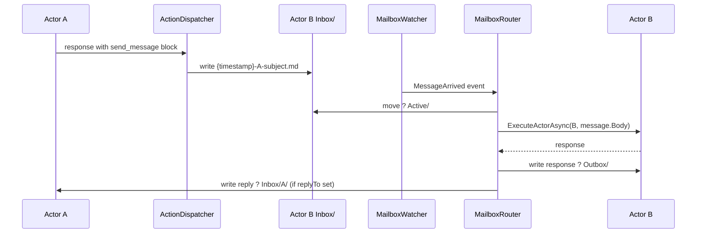

# Mailbox Protocol — Proposal

*Template: [../../Templates/ProposalTemplate.md](../../Templates/ProposalTemplate.md)*

---

## Problem Statement

`Inbox/Outbox/Pending/Active` folders are scaffolded for every actor but no code reads, writes, or routes them. Multi-agent handoff is structurally defined but behaviourally unimplemented. Actors cannot trigger each other without tight pipeline coupling.

---

## Resolution

Implement a file-based inter-actor message protocol: `WallyMessage` (the envelope), `MailboxRouter` (the dispatcher), and `MailboxWatcher` (the trigger). Add a `send_message` built-in action so actors can initiate handoffs from within their response output. Add a `watch` CLI verb for daemon mode.

---

## Related Proposals

| Proposal | Relationship | Notes |
|----------|--------------|-------|
| [AutonomousBotGapsProposal](./AutonomousBotGapsProposal.md) | Parent | Extracted from parent as Phase 3 |
| [AsyncExecutionProposal](./AsyncExecutionProposal.md) | Depends on | `MailboxRouter` dispatches via `ExecuteActorAsync` |
| [AutonomyLoopProposal](./AutonomyLoopProposal.md) | Sibling | Independent; agents inside a loop can emit `send_message` actions |

---

## Phase 3 — Mailbox Protocol (Effort: M)

### Concepts

- `WallyMessage`: file in actor `Inbox/` — filename `{timestamp}-{fromActor}-{subject}.md`; YAML front-matter (`from`, `to`, `subject`, `replyTo`, `correlationId`); markdown body is the prompt payload.
- `MailboxRouter`: new class in `Wally.Core/Mailbox/` — scans Inbox folders; deserialises messages; dispatches via `WallyEnvironment.ExecuteActorAsync`; moves files through lifecycle states.
- `MailboxWatcher`: wraps `FileSystemWatcher` on each actor's `Inbox/` — raises `MessageArrived` event on new `.md` file; `MailboxRouter` subscribes and dispatches.
- `send_message`: new built-in `ActionDispatcher` action — actor emits a structured action block naming a target actor and body; dispatcher writes the `WallyMessage` file into the target's `Inbox/`.

### `send_message` Action Schema

```
name: send_message
to: Engineer
subject: FeasibilityCheck
body: |
  Please review the following requirements for technical feasibility...
```

`ActionDispatcher` resolves the target actor's `Inbox/` path from `WorkSource`; validates the actor exists before writing (error result on failure — no silent message loss).

### Message Lifecycle

```
Actor A emits send_message block
  ? ActionDispatcher writes Inbox/B/{timestamp}-A-subject.md
  ? MailboxWatcher fires MessageArrived
  ? MailboxRouter moves file ? Active/B/
  ? ExecuteActorAsync(B, message.Body, ...)
  ? response
  ? MailboxRouter writes response ? Outbox/B/{correlationId}-response.md
  ? MailboxRouter deletes from Active/B/
  ? (if replyTo set) MailboxRouter writes reply ? Inbox/A/{correlationId}-reply.md
```

### Failure Handling

- On exception: file moved from `Active/` ? `Pending/` with error header appended.
- `repair` command extended: scans `Active/` for stale files (configurable age threshold); moves them back to `Pending/` for retry. Does not expose message content in console output.

### Wally.Console Daemon Mode

New CLI verb `watch` — calls `MailboxRouter.StartWatching(env)` and blocks until `Ctrl+C`. Enables `wally watch` as a long-running background process.

---

## Impact

| File / System | Change |
|---|---|
| `Wally.Core/Actions/ActionDispatcher.cs` | Add `send_message` built-in handler |
| `Wally.Core/Mailbox/WallyMessage.cs` | New — message envelope model |
| `Wally.Core/Mailbox/MailboxRouter.cs` | New — scan, dispatch, lifecycle management |
| `Wally.Core/Mailbox/MailboxWatcher.cs` | New — `FileSystemWatcher` wrapper |
| `Wally.Console/Program.cs` | Add `watch` verb |
| `Wally.Console/Options/Run/WatchOptions.cs` | New — verb options class |

---

## Benefits

- Actors become truly independent agents — one triggers another via a file drop without pipeline coupling.
- `MailboxWatcher` enables daemon mode; `correlationId` gives traceability across multi-actor chains.
- Failure handling is explicit and auditable (files in `Pending/`); `repair` command provides manual retry.

---

## Risks

- **`FileSystemWatcher` reliability** — not reliable on network drives or some Docker volumes. Add a polling fallback with configurable interval.
- **`send_message` target validation** — must confirm the target actor exists before writing; return an error action result if not loaded.
- **Message content is sensitive** — `repair` command must not expose body content in console output.

---

## Open Questions

1. Should the `watch` daemon auto-restart on workspace reload, or require a manual restart? Recommendation: manual restart for Phase 3; auto-restart adds file-handle complexity.
2. Should `WallyMessage` body support **structured parameters** (YAML key-value pairs beyond front-matter) or remain free-text markdown? Recommendation: free-text; structured params are a Phase 4 extension.
3. Should failed messages in `Pending/` be retried automatically (with backoff) or only manually via `repair`? Recommendation: manual via `repair` to avoid amplifying transient LLM errors.

---

## Mermaid Diagrams


