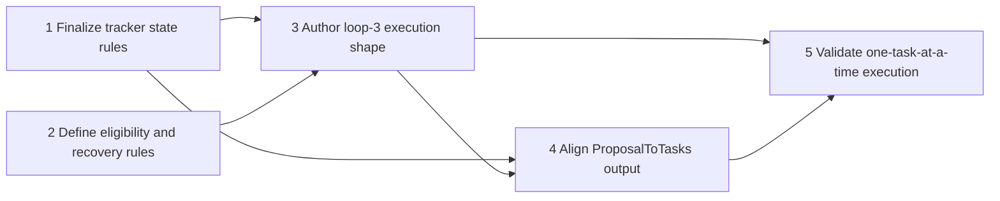

# Task Execution Loop Proposal - Task Tracker

**Source Proposal**: [TaskExecutionLoopProposal.md](./TaskExecutionLoopProposal.md)
**Status**: Blocked
**Created**: 2026-03-29
**Last Updated**: 2026-04-05
**Owner**: @developer

*Template: [../../Templates/TaskTrackerTemplate.md](../../Templates/TaskTrackerTemplate.md)*

## Summary

This tracker covers the five tasks required to define and validate ExecuteTasksLoop against a real task tracker; Tasks 1-4 are complete, and Task 5 remains blocked only on an upstream ProposalToTasks validation path that still fails with the wrapper command-length error.

## Task List

#### Phase 1: Finalize task state transitions and dependency rules

| # | Task | Description | Priority | Effort | Status | Owner | Dependencies | Done-Condition |
|---|------|-------------|----------|--------|--------|-------|--------------|----------------|
| 1 | Finalize tracker state rules | Update Wally.Core/Default/Templates/TaskTrackerTemplate.md so the Not Started, In Progress, Blocked, and Complete transitions, dependency gating, and done-condition verification exactly match the ExecuteTasksLoop contract described in Wally.Core/Default/Projects/Proposals/TaskExecutionLoopProposal.md. | High | 4h | Complete | @developer | - | TaskTrackerTemplate.md documents the full task state model and dependency rules needed for loop 3 execution. |
| 2 | Define eligibility and recovery rules | Codify how the ExecuteTasksLoop component chooses eligible tasks, reevaluates blocked tasks, and distinguishes recoverable blocked state from true execution failure in Wally.Core/Default/Projects/Proposals/TaskExecutionLoopProposal.md and its runtime contract. | High | 4h | Complete | @developer | - | The execution contract explicitly defines eligibility, blocked-state recovery, and failure outcomes without ambiguity. |

#### Phase 2: Define loop-3 step flow and stop outcomes

| # | Task | Description | Priority | Effort | Status | Owner | Dependencies | Done-Condition |
|---|------|-------------|----------|--------|--------|-------|--------------|----------------|
| 3 | Author loop-3 execution shape | Create the default ExecuteTasksLoop step sequence and explicit stop outcomes such as ALL_TASKS_COMPLETE, TASKS_BLOCKED, and EXECUTION_FAILED in the ExecuteTasksLoop component definition or runtime contract. | High | 1d | Complete | @developer | 1, 2 | ExecuteTasksLoop has a concrete step flow and named stop outcomes that match the proposal. |

#### Phase 3: Align task tracker generation with execution requirements

| # | Task | Description | Priority | Effort | Status | Owner | Dependencies | Done-Condition |
|---|------|-------------|----------|--------|--------|-------|--------------|----------------|
| 4 | Align ProposalToTasks output | Update Wally.Core/Default/Loops/ProposalToTasks.json so generated trackers always include dependencies, owner placeholders, done-conditions, and progress data that ExecuteTasksLoop relies on when selecting and updating a task. | High | 4h | Complete | @developer | 1, 3 | ProposalToTasks.json cannot produce a tracker that omits any field needed by ExecuteTasksLoop to choose and update a task safely. |

#### Phase 4: Validate loop behavior against a real task tracker

| # | Task | Description | Priority | Effort | Status | Owner | Dependencies | Done-Condition |
|---|------|-------------|----------|--------|--------|-------|--------------|----------------|
| 5 | Validate one-task-at-a-time execution | Use a real generated *Tasks.md tracker to verify that ExecuteTasksLoop picks one eligible task, updates tracker state safely, and stops cleanly in complete or blocked state without relying on hidden execution memory. | Medium | 1d | Blocked | @developer | 3, 4 | A real tracker can be consumed one eligible task at a time and the resulting stop outcome matches the documented execution rules. |

## Task State Rules

- Every new task starts as `Not Started`.
- A task may move from `Not Started` to `In Progress` only when every listed dependency is `Complete`.
- A task already marked `In Progress` remains eligible for continuation until it becomes `Complete` or `Blocked`.
- A task moves to `Blocked` when execution cannot responsibly continue.
- When a task is `Blocked`, review its declared dependencies first before introducing a new blocker explanation.
- When all dependencies for a blocked or not-started task are complete and any blocker has been resolved, that task becomes eligible to start or resume.
- A task may move to `Complete` only when its done-condition has been verified.
- `Blocked` is a recoverable state, not a terminal state for the tracker.

## Dependency Rules

- Every task defines a `Dependencies` value.
- `-` means the task has no prerequisites.
- Dependencies use task numbers.
- A dependency is declared only when one task truly cannot begin until another is complete.
- Execution should focus on one eligible task at a time.

## Done-Condition Rules

- Every task must define a specific done-condition.
- Done-conditions must be externally checkable from files, commands, tests, or observable runtime behavior.
- Avoid vague completion language such as "works correctly" or "is handled."
- If verification requires a named command, test, file, or output, state that explicitly.

## Dependency Map

## Blockers & Notes

| Task # | Blocker / Note | Raised | Resolved |
|--------|----------------|--------|----------|
| 5 | `ExecuteTasksLoop` is now shipped in `Wally.Core/Default/Loops/ExecuteTasksLoop.json`, and the Core task-tracker runtime plus code handlers now compile into the solution. | 2026-03-30 | 2026-04-05 |
| 5 | `dotnet run --project Wally.Console -- --workspace Wally.Core/Default run "Projects/Proposals/RunbookSyntaxProposal.md" -a ProjectPlanner -l ProposalToTasks` still stops in iteration 1 with `Error from Copilot (exit 1): The command line is too long.`, so the upstream tracker-generation handoff is not yet validating cleanly against a real proposal. | 2026-03-30 | - |

## Progress Summary

| Phase | Total | Done | Active | Blocked | Remaining |
|-------|-------|------|--------|---------|-----------|
| Phase 1 | 2 | 2 | 0 | 0 | 0 |
| Phase 2 | 1 | 1 | 0 | 0 | 0 |
| Phase 3 | 1 | 1 | 0 | 0 | 0 |
| Phase 4 | 1 | 0 | 0 | 1 | 0 |
| **Total** | **5** | **4** | **0** | **1** | **0** |
