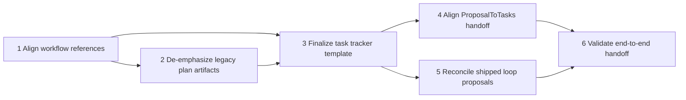

# Three Loop Workflow Proposal - Task Tracker

**Source Proposal**: [ThreeLoopWorkflowProposal.md](./ThreeLoopWorkflowProposal.md)
**Status**: Blocked
**Created**: 2026-03-29
**Last Updated**: 2026-04-05
**Owner**: @developer

*Template: [../../Templates/TaskTrackerTemplate.md](../../Templates/TaskTrackerTemplate.md)*

## Summary

This tracker covers the six tasks required to make InvestigationLoop -> ProposalToTasks -> ExecuteTasksLoop the canonical default workflow; Tasks 1-5 are complete, and Task 6 remains blocked only because loop-2 validation still fails with a wrapper command-length error.

## Task List

#### Phase 1: Finalize the canonical three-loop workflow and artifact handoffs

| # | Task | Description | Priority | Effort | Status | Owner | Dependencies | Done-Condition |
|---|------|-------------|----------|--------|--------|-------|--------------|----------------|
| 1 | Align workflow references | Update Wally.Core/Default/Projects/Proposals/ThreeLoopWorkflowProposal.md, Wally.Core/Default/Projects/Proposals/InvestigationLoopProposal.md, and Wally.Core/Default/Projects/Proposals/TaskExecutionLoopProposal.md so they all describe the same InvestigationLoop -> ProposalToTasks -> ExecuteTasksLoop order and artifact handoffs. Remove contradictory wording about the default path. | High | 4h | Complete | @developer | - | All three proposal docs describe the same default loop order, output artifact for each loop, and manual transition model without contradiction. |
| 2 | De-emphasize legacy plan artifacts | Update Wally.Core/Default/Templates/ProposalTemplate.md, Wally.Core/Default/Loops/ProposalToImplementationPlan.json, and Wally.Core/Default/Runbooks/proposal-to-implementation.wrb so implementation plans are no longer presented as part of the default workflow. Keep any legacy path clearly marked as non-default or deprecated. | High | 4h | Complete | @developer | 1 | The proposal template and legacy loop/runbook artifacts no longer claim that implementation plans are required by the default workflow. |

#### Phase 2: Align task tracker structure with execution needs

| # | Task | Description | Priority | Effort | Status | Owner | Dependencies | Done-Condition |
|---|------|-------------|----------|--------|--------|-------|--------------|----------------|
| 3 | Finalize task tracker template | Make Wally.Core/Default/Templates/TaskTrackerTemplate.md the canonical execution artifact by locking in dependency fields, task state rules, done-conditions, and progress summary expectations needed by ExecuteTasksLoop. | High | 1d | Complete | @developer | 1, 2 | TaskTrackerTemplate.md defines the authoritative tracker structure and every field needed by task execution is explicit. |
| 4 | Align ProposalToTasks handoff | Update Wally.Core/Default/Loops/ProposalToTasks.json so it produces exactly one *Tasks.md tracker and its instructions match the finalized task tracker fields required by execution. | High | 4h | Complete | @developer | 3 | ProposalToTasks.json instructs the loop to write only the canonical tracker artifact with the required dependency, ownership, and done-condition fields. |

#### Phase 3: Align loop proposals and shipped loop definitions with the canonical workflow

| # | Task | Description | Priority | Effort | Status | Owner | Dependencies | Done-Condition |
|---|------|-------------|----------|--------|--------|-------|--------------|----------------|
| 5 | Reconcile shipped loop proposals | Reconcile Wally.Core/Default/Projects/Proposals/InvestigationLoopProposal.md and Wally.Core/Default/Projects/Proposals/TaskExecutionLoopProposal.md with the finalized task-tracker handoff and the ability-optional loop language established by the workflow proposal. | Medium | 4h | Complete | @developer | 3, 4 | The loop proposals use the same handoff terminology, task-tracker assumptions, and ability-optional guidance as the canonical workflow doc. |

#### Phase 4: Validate the workflow manually end to end

| # | Task | Description | Priority | Effort | Status | Owner | Dependencies | Done-Condition |
|---|------|-------------|----------|--------|--------|-------|--------------|----------------|
| 6 | Validate end-to-end handoff | Run one real proposal through Wally.Core/Default/Loops/ProposalToTasks.json and verify that the resulting tracker can be handed to the ExecuteTasksLoop component without needing an implementation plan or execution plan. Capture any mismatches in the workflow proposal or tracker template. | Medium | 1d | Blocked | @developer | 4, 5 | A proposal can be decomposed into a tracker and handed into loop 3 without any plan-based intermediate artifact, and any gaps found are documented. |

## Task State Rules

- Every new task starts as `Not Started`.
- A task may move from `Not Started` to `In Progress` only when every listed dependency is `Complete`.
- A task moves to `Blocked` when execution cannot responsibly continue.
- When a task is `Blocked`, review its declared dependencies first before introducing a new blocker explanation.
- When all dependencies for a blocked or not-started task are complete, that task becomes eligible to start.
- A task may move to `Complete` only when its done-condition has been verified.
- `Blocked` is a recoverable state, not a terminal state for the tracker.

## Dependency Rules

- Every task defines a `Dependencies` value.
- `-` means the task has no prerequisites.
- Dependencies use task numbers.
- A dependency is declared only when one task truly cannot begin until another is complete.
- Execution should focus on one eligible task at a time.

## Dependency Map

## Blockers & Notes

| Task # | Blocker / Note | Raised | Resolved |
|--------|----------------|--------|----------|
| 6 | `gh copilot -- --version` now succeeds, so the original missing-CLI blocker has been cleared. | 2026-03-29 | 2026-03-30 |
| 6 | `dotnet run --project Wally.Console -- --workspace Wally.Core/Default run "Projects/Proposals/RunbookSyntaxProposal.md" -a ProjectPlanner -l ProposalToTasks` now reaches the wrapper but still stops in iteration 1 with `Error from Copilot (exit 1): The command line is too long.`, so no real tracker was generated for end-to-end handoff validation. | 2026-03-30 | - |
| 6 | `ExecuteTasksLoop` is now present as a shipped default loop definition, so loop-3 handoff is implemented and available for the remaining end-to-end workflow validation work. | 2026-03-30 | 2026-04-05 |

## Progress Summary

| Phase | Total | Done | Active | Blocked | Remaining |
|-------|-------|------|--------|---------|-----------|
| Phase 1 | 2 | 2 | 0 | 0 | 0 |
| Phase 2 | 2 | 2 | 0 | 0 | 0 |
| Phase 3 | 1 | 1 | 0 | 0 | 0 |
| Phase 4 | 1 | 0 | 0 | 1 | 0 |
| **Total** | **6** | **5** | **0** | **1** | **0** |
