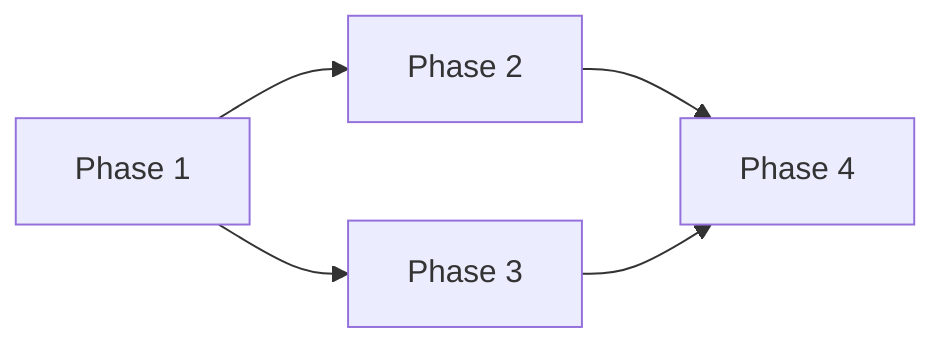

# Implementation Plan Template

> Reference: All implementation plan documents must conform to this template.

---

## Document Constraints

| Constraint | Rule |
|------------|------|
| **Audience** | Senior engineers + AI agents; domain expertise assumed |
| **Scope** | Execution roadmap for an approved proposal: phases, steps, files, timeline |
| **Out of Scope** | Design rationale; requirements authoring; test procedures |
| **Maintenance** | Update as implementation progresses |
| **Density** | Max info/line; no filler |
| **Code** | Inline signatures only (?1 line); source is implementation |
| **Diagrams** | Mermaid only; no ASCII |
| **Length** | Target <150 lines; split if exceeds |
| **Todo Tracking** | Every implementation plan must track phase completion and blockers |
| **Acceptance Criteria** | Every phase must have clear completion criteria and validation steps |

---

## Objectives

- Provide a step-by-step, AI-executable roadmap for delivering an approved proposal.
- Make progress trackable at the phase level without requiring source code inspection.
- Eliminate ambiguity about file targets, actions, and validation criteria.
- Enable systematic tracking of implementation progress and phase dependencies.

---

## Document Relationships

| Relates To | Relationship | Notes |
|------------|--------------|-------|
| ProposalTemplate | Follows | Every implementation plan implements an approved proposal |
| RequirementsTemplate | Follows | Steps must satisfy approved requirements |
| TestPlanTemplate | Precedes | Test plans validate what this plan builds |
| ExecutionPlanTemplate | Follows | Execution plans orchestrate one or more implementation plans |
| ArchitectureTemplate | Informs | Architecture docs may constrain implementation choices |

---

## Required Sections

### Header
```markdown
# [System] Implementation Plan

**Status**: [Draft | In Progress | Complete | Blocked]
**Owner**: [Lead Engineer]
**Started**: [Date]
**Target Completion**: [Date]

*Template: [../Templates/ImplementationPlanTemplate.md](../Templates/ImplementationPlanTemplate.md)*
```

### Summary
One line: system name, phase count, total days.

### Proposal Breakdown

| Phase | Days | Deps | Deliverable | Status |
|-------|------|------|-------------|--------|
| Phase 1 | 2 | None | Core interfaces | ? Complete |
| Phase 2 | 3 | Phase 1 | Implementation | ?? In Progress |
| Phase 3 | 1 | Phase 2 | Tests | ?? Paused |

### Phase Dependencies
Mermaid `flowchart LR` when phases have non-linear dependencies.



### Detailed Steps
Per phase:
```markdown
### Phase N: [Name]
1. [ACTION] `File.cs` — Description
2. [ACTION] `File.cs:Method` — Description
3. Test: [assertion]
```

Actions: `CREATE`, `MODIFY`, `DELETE`, `TEST`

### Timeline

| Days | Phase | Parallel? | Status |
|------|-------|-----------|--------|

### Resources

| Devs | Scope | Tools |
|------|-------|-------|

### Risks

| Risk | Mitigation | Status |
|------|-----------|--------|

### Todo Tracker

| Task | Phase | Priority | Status | Owner | Due Date | Notes |
|------|--------|----------|--------|-------|----------|-------|
| Create base interfaces | Phase 1 | High | ? Complete | @engineer1 | 2024-01-10 | Core abstractions done |
| Implement service layer | Phase 2 | High | ?? In Progress | @engineer1 | 2024-01-15 | 70% complete |
| Add error handling | Phase 2 | Medium | ?? Blocked | @engineer2 | 2024-01-16 | Waiting on exception strategy |
| Write unit tests | Phase 3 | High | ?? Paused | @engineer2 | 2024-01-18 | Waiting on Phase 2 completion |

**Legend**: 
- Priority: `High | Medium | Low`
- Status: `?? Blocked | ?? In Progress | ? Complete | ?? Paused`

### Acceptance Criteria

#### Must Have (Required for Completion)
- [ ] All phases completed with deliverables validated
- [ ] Each phase's acceptance criteria met and verified
- [ ] All code changes reviewed and merged
- [ ] Implementation satisfies original proposal requirements
- [ ] Integration tests pass for all new functionality
- [ ] Documentation updated to reflect implementation

#### Should Have (Preferred for Quality)
- [ ] Performance benchmarks meet or exceed targets
- [ ] Error handling covers all identified edge cases
- [ ] Code coverage above 80% for new components
- [ ] Architecture review completed and approved

#### Completion Checklist
- [ ] All "Must Have" criteria completed
- [ ] Final code review and approval obtained
- [ ] Implementation tested in staging environment
- [ ] All todo items resolved or transferred to maintenance
- [ ] Status updated to "Complete"

---

## Acceptance Criteria Definition

### Completion Checklist
- All phases delivered with concrete, testable deliverables
- Each phase completion validated through specific acceptance criteria
- Implementation matches approved proposal specifications
- Code quality gates met (review, tests, documentation)
- Integration with existing system verified

### Quality Gates
- Every phase must have measurable completion criteria
- All code changes must pass review and automated tests
- Performance targets from requirements must be validated
- Security and reliability requirements must be verified

### Sign-off Requirements
- Lead engineer approval for technical implementation
- Architect approval for design conformance
- Product owner acceptance of functional deliverables
- QA validation of test coverage and quality

---

## Todo Tracker Specification

### Task Categories
- **Setup**: Environment preparation, scaffolding, initial setup
- **Development**: Core implementation, feature development, coding tasks
- **Testing**: Unit tests, integration tests, validation
- **Review**: Code review, technical review, approval processes
- **Deployment**: Build, deployment, production readiness

### Priority Levels
- **High**: Critical path items, blocking dependencies, must-have features
- **Medium**: Important but not critical, quality improvements
- **Low**: Nice-to-have items, cleanup tasks, documentation polish

### Status Values
- **?? Blocked**: Cannot proceed due to dependency or external blocker
- **?? In Progress**: Actively being worked on
- **? Complete**: Finished and validated
- **?? Paused**: Temporarily stopped, waiting for conditions

### Assignment Rules
- Every task must have a clear owner (@username format)
- Tasks should align with phase boundaries and dependencies
- Blocked tasks must include detailed explanation and mitigation plan
- Due dates must be realistic and account for dependencies

---

## Optional Sections

### References
Include when: the plan draws on or must stay consistent with external documents.

| Document | Relationship |
|----------|-------------|

Use relationship vocabulary from TemplateTemplate: `Precedes / Follows / Implements / Verifies / Spawns / Supersedes / Informs`.

---

## Formatting Rules

| Element | Format |
|---------|--------|
| Code / identifiers | Backtick inline code |
| Diagrams | Mermaid only |
| Structured data | Tables preferred over prose |
| Lists | Numbered for steps; bullets for unordered items |
| Phase headings | `### Phase N: Name` |
| Step actions | `CREATE / MODIFY / DELETE / TEST` prefix |
| Dependency flows | Mermaid or inline `A ? B` |
| Todo items | `- [ ]` unchecked or `- [x]` checked checkbox format |
| Status indicators | Emoji prefixes: ?? Blocked, ?? In Progress, ? Complete |

---

## Anti-Patterns

| ? Avoid | ? Instead |
|----------|-----------|
| Prose descriptions | Numbered steps with action prefixes |
| Vague deliverables | Concrete: "method returns X" |
| Multi-line code | Inline signatures only |
| ASCII diagrams | Mermaid |
| Unbounded phases | Each phase ?3 days |
| Design rationale | Link to the proposal |
| Tasks without owners | Every task must have clear assignment |
| Phases without acceptance criteria | Every phase must have validation criteria |

---

## File Naming

`[SystemName]ImplementationPlan.md` — PascalCase, suffix `ImplementationPlan`.

Examples: `AsyncExecutionImplementationPlan.md`, `MailboxProtocolImplementationPlan.md`