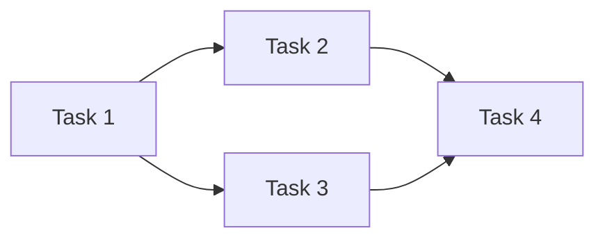

# Task Tracker Template

> Reference: All task tracker documents must conform to this template.
> Generated by the **ProjectPlanner** actor from an approved proposal.

---

## Document Constraints

| Constraint | Rule |
|------------|------|
| **Audience** | Engineers and AI agents executing against an approved proposal |
| **Scope** | Task decomposition and progress tracking for one proposal |
| **Out of Scope** | Design rationale; requirements authoring; architecture decisions |
| **Maintenance** | Update Status and Notes fields as work progresses |
| **Density** | Max info/line; no filler |
| **Naming** | `<ProposalName>Tasks.md` — same directory as the source proposal |
| **One tracker per proposal** | Do not combine tasks from multiple proposals in one file |

---

## Required Sections

### Header

```markdown
# [Proposal Name] — Task Tracker

**Source Proposal**: [link to proposal file]
**Status**: [Active | Complete | Blocked | Paused]
**Created**: [Date]
**Last Updated**: [Date]
**Owner**: [Lead / Team]

*Template: [../Templates/TaskTrackerTemplate.md](../Templates/TaskTrackerTemplate.md)*
```

### Summary

One sentence: what this tracker covers and how many tasks it contains.

### Task List

Tasks ordered by dependency (blockers first within each phase). Use phases when the source proposal defines them; use a single flat section otherwise.

#### Phase N: [Phase Name]  *(repeat per phase, or omit wrapper if no phases)*

| # | Task | Description | Priority | Effort | Status | Owner | Done-Condition |
|---|------|-------------|----------|--------|--------|-------|----------------|
| 1 | Short title | What exactly to do in 1–3 sentences | High | 2h | ? Not Started | @owner | Specific, verifiable completion criterion |
| 2 | Short title | What exactly to do in 1–3 sentences | Medium | 1d | ?? In Progress | @owner | Specific, verifiable completion criterion |

**Priority**: `High | Medium | Low`

**Effort shorthand**: `30m | 1h | 2h | 4h | 1d | 2d | 3d+`

**Status values**:

| Emoji | Label | Meaning |
|-------|-------|---------|
| ? | Not Started | Awaiting initiation |
| ?? | In Progress | Actively being worked |
| ? | Complete | Done and verified |
| ?? | Blocked | Cannot proceed — blocker noted in Notes |
| ? | Paused | Temporarily stopped |

### Dependency Map

Include a Mermaid diagram when tasks have non-trivial dependencies. Omit for purely sequential lists.



### Blockers & Notes

| Task # | Blocker / Note | Raised | Resolved |
|--------|---------------|--------|----------|
| 3 | Waiting on schema approval from @architect | 2024-01-12 | — |

*(Omit section if no blockers.)*

### Progress Summary

Auto-update this section as tasks complete.

| Phase | Total | ? Done | ?? Active | ?? Blocked | ? Remaining |
|-------|-------|---------|-----------|-----------|-------------|
| Phase 1 | 4 | 2 | 1 | 0 | 1 |
| **Total** | **4** | **2** | **1** | **0** | **1** |

---

## Formatting Rules

| Element | Format |
|---------|--------|
| Task titles | Short imperative phrase: "Add X", "Update Y", "Remove Z" |
| Descriptions | 1–3 sentences; reference specific files/methods/components |
| Done-conditions | Specific and verifiable: "Method returns X", "Test passes", "File exists at path" |
| Diagrams | Mermaid only |
| Code references | Backtick inline code |
| Status | Emoji + label from the table above |

---

## Anti-Patterns

| ? Avoid | ? Instead |
|----------|-----------|
| Vague tasks ("Fix things") | Specific: "Fix null check in `Actor.ProcessPrompt`" |
| Tasks requiring two unrelated actions | Split into two tasks |
| Done-conditions that are unmeasurable | "Unit test `TestX` passes with 100% coverage" |
| Mixing tasks from multiple proposals | One tracker per proposal |
| Tasks without effort estimates | Every task must have an estimate |
| Inventing scope not in the proposal | Only decompose what the proposal explicitly states |

---

## File Naming

`[ProposalName]Tasks.md` — same directory as the source proposal, PascalCase.

Examples: `AsyncExecutionProposalTasks.md`, `MailboxProtocolProposalTasks.md`
